# MangrovesDB - Blockchain Technical Review

## Blockchain Use-Cases and DeFi Specification

### Problems with centralized finance
Five problems
- **Centralized control**:
  - Centralized banking system is highly concentrated
  - National central banks control currency
  - Non-financial centralization of tech giants, e.g., Amazon-retail, Facebook/Google-digital advertising
  
- **Limited access**:
  - 1.7 billion unbanked
  - Billions underbanked
  - Many entrepreneurs use credit cards to finance their businesses, since banks won’t lend to them because they are small (negative impact on growth)
    
- **Inefficiency**:
  - 3% for a credit card swipe
  - 5-7% for a wire transfer
  - 2 days settlement time for a stock transaction
  - Slow transfers of funds
  - Fraud, chargebacks, insecurity
  - No micro transactions
  - Difficult to get paid
    
- **Lack of interoperability**:
  - Siloed institutions
  - Difficult to move money from one banking institution to another
  - Difficult to move money from a bank to a non-bank
  - Note: Visa attempted acquisition of fintech company Plaid
    
- **Opacity**:
  - Very little transparency
  - Bank customers do not know the health of the bank
  - Must rely on costly regulation and the promise of bailouts


## Bitcoin and cryptocurrency
- Stuart Haber and Scott Stornetta (1991) invent the blockchain idea to keep track of time stamping of documents
- Adam Back (2002) invents the Proof of Work idea. It is based on a key paper by Cynthia Dwork and Moni Naor (1992) that was aimed at eliminating junk mail (require the sender to do a computational task to send the email to you, while this is easy to do once – it is infeasible to do for millions of recipients)
- Satoshi Nakamoto (2008) put these ideas together to introduce bitcoin
- Bitcoin eliminated the key problem with digital currencies in the past (you can make a perfect digital copy and “double spend”)
- Every transaction would be kept in an immutable ledger (censorship resistant blockchain) and the ledger would be distributed across many different computers
- Cryptographic scarcity was enforced by a limit of 21 million bitcoins
- User sovereignty (only owner determines how to spend)
- Portability in that you can send or receive anywhere quickly and cheaply


## Bitcoin vs. fiat
- Scarcity and self-sovereignty create the potential for store of value
- While untested, there is no direct link to economic activity or inflation, so there could be some hedging
- Bitcoin was originally intended to be a peer-to-peer currency. However, its deflationary characteristics and flat fees discourage its use in small transactions.


## Ethereum history
- Began in 2015 with Vitalik Buterin
- Allows for running of computer programs. So Ethereum is a distributed computational platform offering functionality via offering a “smart contract platform”
- Smart contracts control assets and data, and define interactions between assets, data, and network participants.

## dApps
- Decentralized applications allow peers to interact directly and remove the need for a central clearing house for app interactions
- DeFi is fundamentally a competitive marketplace of financial dApps that function as various financial “primitives” such as exchange, lend, tokenize, and so forth.
- These dApps benefit from the network effects of combining and recombining DeFi products, and attracting increasingly more market share from the traditional financial ecosystem.

## What is blockchain?
- Blockchains are fundamentally software protocols that allow multiple parties to operate under shared assumptions and data without trusting each other
- These data can be anything, such as location and destination information of items in a supply chain or account balances of a token
- Updates are packaged into “blocks” and are “chained” together cryptographically to allow an audit of the prior history, hence the name.

## Hashing --> Blockchain
SHA-256 (Secure Hashing Algorithm)
https://emn178.github.io/online-tools/sha256.html
- Hashing is a one-way function.
- Hashing is not “encryption” because you can’t decrypt.
- For example, passwords are routinely stored on websites in hashed form.
- The output of a SHA-256 is 256 bits no matter how big the input
- Represented in hexadecimal form 0-9,1-f. Hence, 64 characters long.
- Hashing function: provide the chain (the entire last block as the header of the next). Bitcoin SHA-256; Ethereum Keccak-256 (SHA-3). One way cryptographic function (infeasible to go the other way)
- Hashing is a one-way function. It is not encryption – though it is little confusing it is called a cryptographic function
### Key ingredients
- Cryptography: This is widely used in all aspects of blockchain. It is particularly important in deriving the public key and the DSA. We will also see that other types of cryptography are used in certain blockchain applications (for example, you might find it useful to have a contract codified in a blockchain – but you only want it visible to the contracting parties.
- ```Two types of cryptography```: **Symmetric key and asymmetric key**
- Private keys/Public keys: Private key is just a random number. The public key is mathematically linked to the private key. It is easy to go from the private key to the public key – but very difficult to go from public to private. Current technology uses Elliptic Curve Cryptography (ECC)
- **Digital Signatures**: When doing a transaction, you “sign over” your cryptocurrency to someone else using a Digital Signature Algorithm (DSA). The signature proves that you are the owner of the private key. Anyone observing the signature and the public key can verify that you have the private key (without revealing the private key).
- **Transaction mechanics**: For many cryptocurrencies like bitcoin, we deal with unspent transaction outputs (UTXOs). If I have an UTXO of say 10 units and I want to send 7 to Jenna, Jenna generates a private key (and a public key). I generate a (potentially) new private key (and public key). In a single transaction, I sign over 7 to Jenna and 3 to myself (think of this as “change”). I have a new UTXO of 3 units. The old one resides in a blockchain but has no value. Ethereum uses a different system of account balances.
    - Cryptocurrency doesn’t move anywhere. Everything remains on the associated blockchain.
- **Consensus Mechanisms**: Consensus is the mechanism by which nodes agree on both the historical blockchain as well as the new additions to the historical blockchain. Consensus is an agreement among a group of people on an idea, statement, or plan of action.

#### Public and private keys
- A message needs to go from Sender to Receiver
- Receiver gives the Sender a lock
- Sender locks the message (ciphertext) and transmits to Receiver
- Only the Receiver can decrypt because they have the key
    The lock is the public key
    The key to open the lock is the private key
- Private key is a number called “signing key” (SK). It is secret.
- Public key is the “verification key” and is mathematically linked to the private key


## Blockchain Use-Cases
Solves many problems
- Verification of ownership (quickly check the immutable history recorded on a blockchain to see if someone owns something)
- Efficient exchange of ownership (direct transactions without middle person, everybody treated the same whether customer, retailer or banker).

## Why are blockchains special?
- Blockchains have consensus protocols (a set of rules that determine what kinds of blocks can become part of the chain and become the “truth”.)
- Once in a blockchain, the data remains there forever. This is the immutability property.
- These consensus protocols are designed to be resistant to malicious tampering up to a certain security bound.

## Proof of work
- Ethereum currently relies on Proof of Work (PoW) consensus protocol, which relies on a computational lottery to determine which block to add.
The participants agree that the longest chain of blocks is the truth.
- An attacker needs to amass 51% of the network computational power (this is the boundary of PoW security).
- Given the massive computational power of the Ethereum and Bitcoin networks, it is extremely unlikely that a malicious actor (or even an entire country) can attack these networks. This is not true for other less popular networks.

## Mining
- The computational lottery involves cryptographic hashing.
- Miners group transactions together, make sure they are valid, and add a small piece of metadata called a nonce. They run a hashing function (SHA-256 in Bitcoin and Keccak-256 in Ethereum) and try to get a very small value of the hash by cycling through different nonces.
- This task is computationally burdensome. However, when a miner wins it is very fast to verify that the transactions + nonce = winning hash. When verified, a new block is added.
- Proof of work is both a strength and a weakness of blockchain technology
- Strength because of unprecedented security
- Weakness because the electricity cost of mining is enormous
- Ethereum will move to a different, less energy inefficient, consensus technology
- Bitcoin is likely stuck with proof of work

## What is cryptocurrency?
- Cryptocurrency is a digital token that is cryptographically secured and transferred.
- Asymmetric key cryptography is a crucial component. Owners of cryptocurrency have a private key which is essentially a long random number.
- A public key is mathematically derived from the private key. This is a one way operation (you cannot – using today’s technology) derive the private key from the public key)
- Public addresses are derived from the public key
- If currency is transferred, the sender uses a digital signature algorithm to sign the token over to someone else’s address. The signature mathematically reveals that the sender has the private key associated with the senders public address.
- The token will now reside with the receiver and it can be transferred again using the receivers digital signature based on the receiver’s private key and a new party’s address.


## Smart Contracts

### Enhanced capabilities
- Bitcoin is a payments technology.
- Ethereum is the primary example of a smart contract platform.
- A smart contract is code that can create and transform arbitrary data or tokens on top of the blockchain of which it is a part.
- The concept is powerful because it allows the user to trustlessly encode rules for any type of transaction and even create scarce assets with specialized functionality.


### Trustless
- Many standard business contracts can be algorithmically encoded and algorithmically enforced
- These contracts run on the Ethereum blockchain and are run on every node.
- This is useful for in many use-cases like finance, supply chains, IoT, etc.

### Gas
- Users of smart contracts need to pay a fee, called gas.
- The gas price depends on the complexity of the calculation (think of a fee for using a cloud computing platform)
- Gas fees also help protect attacks on the system that cause an infinite loop of code (known as a halting problem)

### Turing complete
- Gas plays a very important role. A malicious attack would be prohibitively expensive.
- Ethereum is Turing complete – Bitcoin is not.
- A Turing complete language means that if given sufficient resources, the language can calculate anything.

### Gas, Gas Price, and Gas Limit
- Every operation on the Ethereum blockchain requires gas
- A transfer ETH from one address to another requires 21,000 gas
- Each unit of gas has a gas price, which is denoted in gwei. 1 gwei = 1 billionth of an ETH. Gas prices increase as users outbid one another during times of higher network congestion
- If your gas price is much lower than the average gas price, your transaction will likely not be accepted
- The gas limit is the maximum amount of gas a user is willing to use for a transaction. A transaction can include multiple operations.

- Example
    - Assume the average gas price is 150 gwei and we call a function in a smart contract that transfers ETH, checks the balance of an account, and loads 2 bytes of memory from storage
    - The total amount of gas required is 21,000 + 400 + 200 = 21,600
    - The total cost of this transaction is 21,600*150*(1*10-9) = .00324 ETH
    - If we set our gas limit to 25,000, then we will be refunded the excess gas of 3,400
    - If we set our gas limit to 18,000, the miners will be unable to execute the entire transaction. However, we will not be refunded any gas since we still must pay for the computation

### Problems with Gas Prices
- Gas prices vary from 50 gwei to up to 700 gwei in times of high network congestion
- A gas price of 700 gwei and a transaction that requires 21,000 gas will result in $0.0013*21000=$27.3 to transfer money
- Ethereum’s first price auction mechanism allows miners to select transactions with the highest gas fees. This results in users overpaying in gas fees, sometimes by more than 5x.


### EIP 1599
- EIP 1559 is a hard fork that addresses the inefficiencies of the current gas fee mechanisms by instituting a base fee that transactions are required to pay and increasing the gas limit of a block
- The base fee is adjusted depending on network congestion and is burned after the transaction is approved
- Users still have the option to add a tip transaction that goes to a miner. This is useful in times of high congestion when users want to speed up a transaction.

#### Base Fee
- The base fee is adjusted on the amount of gas included in a single block. If the amount of gas in a block is over 12.5 million, then the base fee will increase and vice versa.
- To accommodate the base fee, the current gas limit in a block will be increased to a hard cap of 25 million. The average target is 12.5 million gas
- Burning the base fee puts downward pressure on the supply of ETH. If the ETH Issue: Burn ratio is below 1, then the supply of ETH is decreasing
- Miners/Validators will earn money from proposing blocks and transaction tips. Their expected returns are lower and a few ETH mining pools oppose the update.


### ERC
- ```Ethereum Request for Comment``` or ERC refer to standard interfaces for different types of functionality
- Most popular is ERC-20 which defines an interface for tokens whose units are identical in utility and functionality. It includes behavior such as transferring units and approving operators for using a certain portion of a user’s balance.

### Important ERCs
- **ERC-20** is a ```fungible token```. Traditional examples in fiat are $1 bills all have equal value (though different serial numbers) and 10 $1 bills are equal to a $10 bill
- **ERC-721** are ```non-fungible```. Each token is associated with a particular asset (for example, a loan).
- The benefit of these standards is that application developers can code for one interface, and support every possible token that implements that interface.

### What are oracles?
- Ethereum blockchain only knows what happens on the Ethereum blockchain. What is information is needed from outside the Ethereum blockchain? An ```oracle``` solves this problem.
- An **oracle, in the context of smart contract platforms, is any data source for reporting information external to the blockchain**.
- How can we create an oracle that can authoritatively speak about off-chain information in a trust-minimized way? This is known as the oracle problem.

### Oracle implementations
- An application might host its own oracle. This does not solve the trust problem.
- One '''Ethereum-based''' platform known as [Chainlink](https://chain.link/) is designed to solve the oracle problem by using an aggregation of data sources. The Chainlink whitepaper includes a reputation-based system that is decentralized.


# Use Cases - Full Review Each Section

## DeFi Solves Inefficiency Problem
### Keepers
- Keepers are external participants directly incentivized to provide a service to DeFi protocols, such as monitoring positions to safeguard that they are
sufficiently collateralized or triggering state updates for various functions.
- To ensure that a dApp’s benefits and services are optimally priced, keeper rewards are often structured as an auction.
- Pure, open competition provides value to DeFi platforms by guaranteeing users pay the market price for the services they need.

### Forking
- A fork, in the context of open source code, is a copy and reuse of the code with upgrades or enhancements layered on top.
- A common fork of blockchain protocols is to reference them in two parallel currencies and chains.
- Doing so creates competition at the protocol level and creates the best possible smart contract platform.

### dApps forkable
- Not only is the code of the entire Ethereum blockchain public and forkable, but each DeFi dApp built on top of Ethereum is as well.
- Should inefficient or suboptimal DeFi applications exist, the code can be easily copied, improved, and redeployed through forking.
- Forking and its benefits arise from the open nature of DeFi and blockchains.


### Vampirism
- Vampirism is an exact or near-exact copy of a DeFi platform designed to poach liquidity or users by offering larger incentives than the platform it is
copying.
- The larger incentives usually take the form of inflationary rewards offered at a far higher rate than the original platform offers.
- Users might be attracted to the higher potential reward for the same functionality, which would cause a reduction in usage and liquidity on the initial platform.


### Vampirism risks
- If the inflationary rewards are flawed, over long-term use the clone could perhaps collapse after a large asset bubble.
- The clones could also select closer to optimal models and replace the original platform.
- Vampirism is not an inherent risk or flaw, but rather a complicating factor arising from the pure competition and openness of DeFi.
- The selection process will eventually give rise to more robust financial infrastructure with optimal efficiency.


## DeFi Solves Limited Access Problem
- DeFi gives large underserved groups, such as the global population of the unbanked as well as small businesses that employ substantial portions of
the workforce (for example, nearly 50% in the United States) direct access to financial services.
- The resulting impact on the entire global economy should be positive. Even consumers who have access to financial services in traditional finance, (bank accounts, mortgages, and credit cards) do not have access to the financial products with the most competitive pricing and most favorable terms; these products and structures are restricted to large institutions.
- DeFi allows any user access to the entirety of its financial infrastructure, regardless of her wealth or geographic location.

### Yield farming
- ```Yield farming``` provides inflationary or contract-funded rewards to users for staking capital or utilizing a protocol.
- These rewards are payable in the same underlying asset the user holds or in a distinct asset such as a governance token.
- Any user can participate in yield farming.
- A user can stake an amount of any size, regardless of how small, and receive a proportional reward.

#### Yield farming benefits
- Yield farming is particularly powerful in the case of governance tokens.
- A user of a protocol that issues a governance token via yield farming becomes a partial owner of the platform through the issued token.
- A rare occurrence in traditional finance, this process is a common way to give ownership of the platform to the people who use and benefit from it.

### Initial DeFi offerings
- An interesting consequence of yield farming is that a user can create an Initial DeFi Offering (IDO) by market making his own Uniswap trading pair (discussed later).
- The user can set the initial exchange rate by becoming the first liquidity provider on the pair.
- Suppose the user’s token is called DFT and has a total supply of 2 million.
- The user can make each DFT worth 0.10 USDC by opening the market with 1 million DFT and 100,000 USDC.
- Any ERC-20 token holder can purchase DFT, which drives up the price. As the only liquidity provider, the user also receives all of the trading fees.
- In this way, the user is able to get his token immediate access to as many users as possible.
- The method sets an artificial price floor for the token if the user controls the supply outside of the amount supplied to the Uniswap market, and as such, inhibits price discovery.
- The trade-offs of an IDO should be weighed as an option, or strategy, for a user’s token distribution.

### IDOs democratize access
- IDOs democratize access to DeFi in two ways.
- First, an IDO allows a project to list on high-traffic DeFi exchanges that do not have barriers to entry beyond the initial capital.
- Second, an IDO allows a user access to the best new projects immediately after the project lists.

## DeFi Solves Opacity Problem
- Traditional finance is not usually transparent.
- DeFi elegantly solves the transparency problem through the open and contractual nature of agreements.
- We will explore how smart contracts and tokenization improve transparency within DeFi.

### Smart contracts are transparent
- All parties of a smart contract are aware of the capitalization of their counterparties and, to the extent required, can see how funds will be deployed.
- The parties can read the contracts themselves to determine if the terms are agreeable to eliminate any ambiguity as to what will happen when they interact under the contract terms.
- This transparency substantially eases the threat of legal burdens and brings peace of mind to smaller players.
- These smaller users, traditional finance, could be abused by powerful counterparties through delaying, increasing the cost, or even completely withholding their end of a financial agreement.
- Realistically, the average consumer does not understand the contract code, but can rely on the open-source nature of the platform and the wisdom of the crowd to feel secure.
- Overall, DeFi mitigates counterparty risk and thus creates a host of efficiencies not present under traditional finance.
### Ensuring appropriate behavior in smart contracts
- One mechanism for ensuring the appropriate behavior of participants is **staking**.
- Staking is escrowing a cryptoasset into a contract, so that the contract releases the cryptoasset to the appropriate counterparty only after the contract terms are met; otherwise, the asset reverts to the original holder.
- Parties can be required to stake on any claims or interactions they make.
- Staking enforces agreements by imposing a tangible penalty for the misbehaving side and a tangible reward for the counterparty.
- The tangible reward should be as good as or even better than the outcome
of the original terms of the contract.
- These transparent incentive structures provide much securer and more obvious guarantees than traditional financial agreements.
### Token contracts
- Another type of smart contract in DeFi that improves transparency is a ```token contract```.
- Tokenization allows for transparent ownership and economics within a system.
- Users can know exactly how many tokens are in the system as well as the inflation and deflation parameters.

## DeFi Solves Centralized Control Problem

### Monopoly in traditional finance
- The fourth flaw of traditional finance is the strong control exerted by governments and large institutions that hold a virtual monopoly over elements such as the money supply, rate of inflation, and access to the best investment opportunities.

### DeFi is decentralized (by definition!)
- DeFi relinquishes control to open protocols having transparent and immutable properties.
- The community of stakeholders or even a predetermined algorithm can control a parameter, such as the inflation rate, of a DeFi dApp.
- If a dApp contains special privileges for an administrator, all users are aware of the privileges, and any user can readily create a less-centralized counterpart.


### Forked away
- Flaws and inefficiencies in a DeFi project can be readily identified and “forked away” by users who copy and improve the flawed project.
- Consequently, DeFi strives to design protocols that naturally and elegantly incentivize stakeholders and maintain a healthy equilibrium through careful mechanism design.


### Decentralization trade-offs
- Centralized control allows for radically decisive action in a crisis, sometimes the necessary approach but also perhaps an overreaction.
- The path to decentralizing finance will certainly encounter growing pains because of the challenges in pre-planning for every eventuality and economic nuance.
- Ultimately, however, the transparency and security gained through a decentralized approach will lead to strong robust protocols that can become trusted financial infrastructure for a global user base.

### Decentralized Autonomous Organization (DAO)
- A decentralized autonomous organization (DAO) has its rules of operation encoded in smart contracts that determine who can execute what behavior or upgrade.
- It is common for a DAO to have some kind of governance token, which gives
an owner some percentage of the vote on future outcomes.


## DeFi Solves Lack of Interoperability Problem

### Traditional finance vs. DeFi
- Traditional financial (TradFi) products are difficult to integrate with each other, generally requiring at minimum a wire transfer, but in many cases cannot be recombined.
- The possibilities for DeFi are substantial and new innovations continue to grow at a non-linear rate.
- This growth is fueled by the ease of composability of DeFi products.

### DeFi Legos
- Given some base infrastructure to, for example, create a synthetic asset, any new protocols allowing for borrowing and lending can be applied.
- A higher layer would allow for attainment of leverage on top of borrowed assets.
- Such composability can continue in an increasing number of directions as new platforms arise.
- For this reason, DeFi Legos is an analogy often used to describe the act of combining existing protocols into a new protocol.

### Tokenization for interactions
- Tokenization is a critical way in which DeFi platforms integrate with each other.
- Take for example a percentage ownership stake in a private commercial real estate venture.
- In traditional finance to use this asset as collateral for a loan would be quite difficult.
- Because DeFi relies on shared interfaces, applications can directly plug into each other’s assets, repackage, and subdivide positions as needed.


### Tokenization of assets
- DeFi has the potential to unlock liquidity in traditionally illiquid assets through tokenization.
- A simple use case would be creating fractional shares from a unitary asset such as a stock.
- We can extend this concept to give fractional ownership to scarce resources such as rare art.
- The tokens can be used as collateral for any other DeFi service, such as leverage or derivatives.

### Bundles
- It is possible to create token bundles of real-world or digital assets and trade them like an ETF.
- Imagine a dApp similar to a real estate investment trust (REIT), but with the added capability of allowing the owner to subdivide the REIT into the individual real estate components to select a preferred geographic distribution and allocation within the REIT.
- Ownership of the token provides direct ownership of the distribution of the properties. The owner can trade the token on a decentralized exchange to liquidate the position.

### Challenges in tokenizing assets
- Tokenizing hard assets, such as real estate or precious metals, is more difficult than tokenizing digital assets because the practical considerations related to the hard assets, such as maintenance and storage, cannot be enforced by code.
- Legal restrictions across jurisdictions are also a challenge for tokenization; nevertheless, the utility of secure, contractual tokenization for most use cases should not be underestimated.

### Pluggable derivative asset
- A ```tokenized version of a position in a DeFi platform``` is a **pluggable derivative asset** that is usable in another platform.
- Tokenization allows the benefits and features of one position to be portable.
- The archetypal example of portability through tokenization is Compound.

### Compound preview
- Compound allows for lending markets in which a position can accrue ```variable-rate interest``` denominated in a given token, and the ```position itself is a token```.
- If, for example, the base asset is ETH, the ETH deposit wrapper known as **cETH (cToken)** can be used in place of the base asset.
- The result is an ETH-backed derivative that is also accruing variable-rate interest per the Compound protocol.
- Tokenization, therefore, unlocks new revenue models for dApps because they can plug asset holdings directly into Compound or use the cToken interface to gain the benefits of Compound’s interest rates.

### Networked liquidity
- The concept of interoperability extends easily to liquidity in the exchange use case.
- Traditional exchanges, in particular those that retail investors typically use, cannot readily share liquidity with other exchanges without special access to a prime broker, which is generally limited to hedge funds.
- In DeFi, as a subcomponent of the contract, any exchange application can leverage the liquidity and rates of any other exchange on the same blockchain.
- This capability allows for networked liquidity and leads to very competitive rates for users within the same application.


# DeFi Primitives

## Fungible tokens: 
There are three main categories of the fungible tokens:
- **Equity tokens**
- **Utility tokens**
- **Governance tokens**

### ERC-20 functionality
- When a token implements the ERC-20 interface, any application that generically handles the defined functionality can instantly and seamlessly integrate with the token.
- Using ERC-20 and similar interfaces, application developers can confidently support tokens that do not yet exist.

### ERC-20 interface
- ```totalSupply()```—read the token’s total supply;
- ```balanceOf(address)```—read the balance of the token for a particular user;
- ```transferFrom(from address, to address, amount)```—send “amount” tokens from the balance of tokens held at “from address” to “to address”; and
- ```approve(owner, spender, amount)```—allows “spender” to spend “amount” tokens of “owner” on behalf of owner.

### Equity tokens
- An ```equity token``` (not traditional stocks) is simply **a token that represents ownership of an underlying asset or pool of assets**.
- The units must be fungible so that each corresponds to an identical share in the pool. For example, suppose a token, TKN, has a total fixed supply of 10,000, and TKN corresponds to an ETH pool of 100 ETH held in a smart contract.
- The smart contract stipulates that for every unit of TKN it receives, it will return a pro rata amount of ETH, fixing the exchange ratio at 100 TKN/1 ETH.
- In actual equity tokens, the pools of assets can contain much more complex mechanics.
    - Variable interest-rate mechanics (```Compound```)
    - Contract that owns a multi-asset pool with a complex fee structure (```Uniswap```).
    - A standard interface for creating equity tokens with static or dynamic holdings (```Set Protocol```).

### Utility tokens
- ```Utility tokens``` are ```fungible tokens``` that are required to utilize some functionality of a smart contract system or that have an intrinsic value proposition defined by its respective smart contract system.
- Examples of use cases for utility tokens:
    - To be collateral (e.g., ```SNX```)
    - To represent reputation or stake (e.g., ```REP```, ```LINK```)
    - To maintain stable value relative to underlying or peg* (e.g., ```DAI```, ```Synthetix Synth```)
    - To pay application-specific fees (e.g., ```ZRX```, ```DAI```, ```LINK```)
- The last example includes all ```stablecoins```, regardless of whether the stablecoin is fiat collateralized, crypto-collateralized, or algorithmic.
- In the case of **USDC**, a ```fiat-collateralized stablecoin```, the utility token operates as its own system without any additional smart-contract infrastructure to support its value.
- The value of USDC arises from the promise of redemption for USD by its backing companies, including Coinbase.

### Governance tokens
- ```Governance tokens``` are similar to equity tokens in the sense they ```represent percentage ownership```. Instead of asset ownership,
governance token ownership applies to ```voting rights```.
- Many smart contracts have embedded clauses stipulating how the system can change; for instance, allowed changes could include adjusting parameters, adding new components, or even altering the functionality of existing components.
- Any platform with admin-controlled functionality is not truly DeFi because of the admins’ centralized control.
- A contract without the capacity for change is necessarily rigid, however, and has no way to adapt to bugs in the code or changing
economic or technical conditions.
- For this reason, many platforms strive for a decentralized upgrade process, often mediated by a governance token.
- A governance token can be implemented in many ways—with a ```static supply```, an ```inflationary supply```, or even a ```deflationary supply```.
- A **static supply** is straightforward: purchased shares would correspond directly to a certain percentage control of the vote.
    - **MKR** is an example of a static supply
- **COMP** is an example of **inflationary supply** to incentive use of the platform.

## Transaction mechanics
### How do transactions work?
- Transactions involve sending data and/or ETH (or other tokens) from one address to another.
- An Ethereum user can control addresses through an ```externally owned account``` (**EOA**) or by using smart contract code (contract account).
- When sending data to a contract account, the data are used to execute code in that contract. The transaction may or may not have an accompanying ETH payment for use by the contract.
- Transactions sent to an EOA can only transfer ETH.
- A single transaction starts with an end-user from an EOA, but can interact with a large number of dApps (or any Ethereum smart contract) before completing.
- The transaction starts by interacting with a single contract, which will enumerate all of the intermediate steps in the transaction
required within the contract body.

### Atomicity
- Clauses in a smart contract can cause a transaction to fail and thereby revert all previous steps of the transaction; as a result,
transactions are ```atomic```.
- Atomicity is a critical feature of transactions because funds can move between many contracts (i.e., “exchange hands”) with the knowledge and security that if one of the conditions is not met, the contract terms reset as if the money never left the starting point.

### Gas
- Transactions have a gas fee, which varies based on the complexity of the transaction. E.g., low gas fee is used to compensate a miner
for including and executing a transaction, and high gas fee for more data-intensive transactions
- If a transaction reverts for any reason, or runs out of gas, the miner forfeits all gas used until that point. Forfeiture protects the miners who, without this provision, could fall prey to large volumes of failed transactions for which they would not receive payment.
- The gas price is determined by the market and effectively creates an auction for inclusion in the next Ethereum block.
- Higher gas fees signal higher demand and therefore generally receive higher priority for inclusion.

### Mempool
- Transactions are posted to a ```memory pool```, or ```mempool```, before they are added to a block.
- Miners monitor these posted transactions, add them to their own mempool, and share the transaction with other miners to be
included in the next available block.
- If the gas price offered by the transaction is uncompetitive relative to other transactions in the mempool, the transaction is
deferred to a future block.

### Miner Extractible Value
- Any actor can see transactions in the mempool by running or communicating with mining nodes.
- This visibility can even allow for advanced “**front-running**”. This is not to be confused with the illegal front-running in centralized finance. If a miner sees a transaction in the mempool (and all transactions are public information), she could profit from by either executing herself or front-running it, the miner is incentivized to do so if lucky enough to win the block.
- **Miner extractable value (MEV)** is a measure of the profit that the miner could make by including, excluding or re-ordering transactions.
- MEV is a drawback to the proof-of-work model.
- Certain strategies, such as obfuscating transactions, can mitigate MEV, thus hiding from miners how they might profit from the transactions.


## Non-Fungible Tokens
### ERC-721
- ```ERC-721``` defines the non-fungible standard.
- It is similar to ERC-20 except that each unit has its own unique ID
- Their alternate name, ```deeds```, implies their use case as representing unique ownership of unitary assets; an example could be ownership
of a particular P2P loan with its own rates and terms.
- Lottery tickets are non-fungible because only one or a limited number will be winning tickets and the remainder are worthless.
- ```NFTs``` can represent ```collectibles``` (e.g., ownership in a piece of art).
- NFT’s have reenergized the art market.

### ERC-1155
- ```ERC-20``` and ```ERC-721``` tokens require an individual contract and address deployed to the blockchain.
- These requirements can be cumbersome for systems that have many tokens, which are closely related, possibly even a mix of fungible and nonfungible token types.
- **ERC-1155** resolves this complexity by defining a ```multi-token``` model in which the contract holds ```balances for a variable number of tokens```, which can be ```fungible``` or ```nonfungible```.


## Supply and Ownership

### Custody

#### Escrow
- A critical DeFi primitive is the ability to ```escrow``` or ```custody funds``` **directly** in a smart contract.
- This is different from the situation in ERC-20 when operators are approved to transfer a user’s balance. In that case, the user still
retains custody of his funds and could transfer the balance at any time or revoke the contract's approval.
- Escrow opens up new capabilities
    - Additional primitives are possible:
        - Retaining fees and disbursing incentives
        - Facilitation of token swaps
        - Market making of a bonding curve
        - Collateralized Loans
        - Auctions
        - Insurance funds
- Escrow opens up new risks
    - Users must exercise caution when sending tokens to contracts because the tokens could become permanently custodied if the contract has no encoded mechanism for releasing the funds of that particular token.


### Supply Adjustment

#### Burn (reduce supply)
- To burn a token means to remove it from circulation.
- Burning a token can take two forms:
    - Manually send a token to an unowned Ethereum address.
    - More efficient is to create a contract that is incapable of spending them.
- Either approach renders the burned tokens unusable, although the decrease in circulating supply would not be “known” by the token contract. Burning is analogous to the destruction or irreversible loss of currency in the traditional finance world, which is unknown to the
issuing government.

#### Burn mistakes
- In practice, ETH or ERC-20 tokens have frequently and accidently been burned using both forms.
- Checksums are one method used to ```prevent accidental burn```.
    - These are cryptographic primitives used to verify data integrity.
    - In the context of Ethereum addresses, **EIP-55** proposed a specific checksum encoding of addresses to stop incorrect addresses’ receiving token transfers.
    - If an address used for a token transfer does not include the correct checksum metadata, the contract assumes the address was mistyped and the transaction would fail.

#### Why burn?
- Here are some practical reasons:
    - Represent exiting of a pool and redemption of underlying (common in equity tokens like cTokens for Compound)
    - Increase scarcity to drive the price upward (e.g., AAVE)
    - Penalize bad acting

### Minting (increase supply)
- Minting increases the number of tokens in circulation.
- Contrary to burning, there is no mechanism for accidentally or manually minting tokens.
- Any mint mechanics have to be directly encoded into the smart contract mechanism.
- There are many use cases for minting as it can incentivize a wider range of user behavior.
- Here are some examples:
    - Represent entering a pool and acquiring corresponding ownership share (common in equity tokens like cTokens for Compound)
    - Decrease scarcity (increase supply) to drive the price downward (seigniorage Stablecoin models like Basis/ESD)
    - Reward user behavior

#### Minting as an Incentive Mechanism
- Inflationary rewards has become a common practice to encourage actions such as supplying liquidity or using a particular platform.
- Many users engage in yield farming, taking actions to seek the highest possible rewards. Platforms can bootstrap their networks by issuing a token with an additional value proposition in their network.
- Users can keep the token or sell it for a profit. Either way, utilization of the token benefits the platform by increasing activity.

### Bonding Curves
- One advantage of being able to adjust supply up and down on a contractual basis is being able to define a **bonding curve**.
- A bonding curve is the ```price relationship between the token supply and a corresponding asset used to purchase the token(s)```.
- In most implementations investors sell back to the curve using the same price relationship.
- The relationship is defined as a mathematical function or as an algorithm with several clauses.

#### Linear Bonding Curves
- Let TKN to denote the price of a token denominated in ETH (which could be any fungible cryptoasset) and use S to represent the supply.
- The simplest possible bonding curve would be TKN=1 (or any constant).
- This algorithmically enforces a ```one to one peg``` between ETH and TKN.
- Next, consider a simple linear bonding curve, where m and b represent the slope and intercept, respectively, in a standard linear
function.
- If m = 1 and b = 0, the first TKN would cost 1 ETH, the second would cost 2 ETH, and so on.
- A monotonically increasing bonding curve rewards early investors, because any incremental demand beyond their purchase price
would allow them to sell back against the curve at a higher price point.

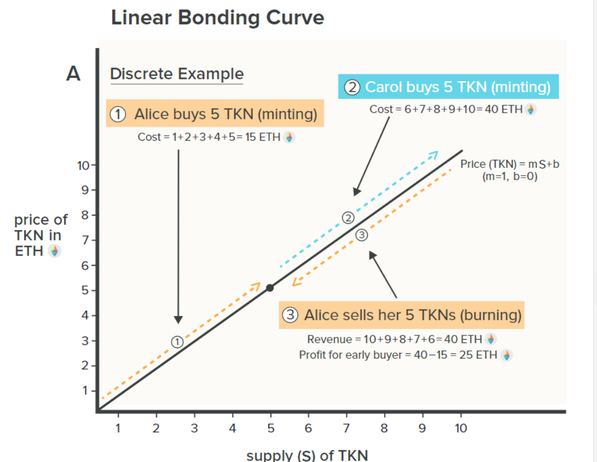

- In above figure, Alice is rewarded for being an early investor.
- The curve can be represented as ```a single smart contract with options for purchasing and selling the underlying token```.
- The token to be sold can have either an uncapped supply with the bonding curve as an authorized minter or a predetermined maximum supply that is escrowed in the bonding curve contract.
- As traders purchase the token, the bonding curve escrows the incoming funding for the point in the future when a trader may want to sell back against the curve.

#### Super-linear Bonding Curves
- Example: TKN = S^2
- More extreme rewards for early investors

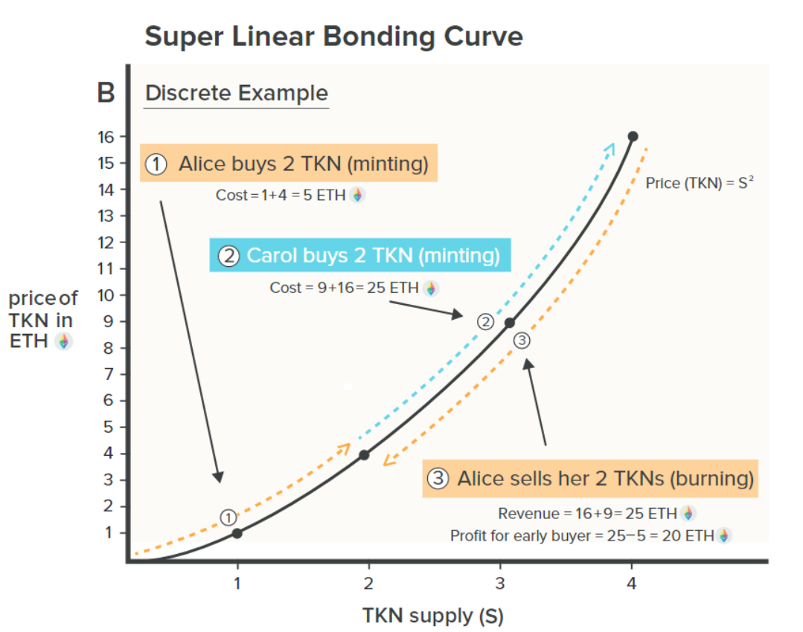

#### Logistic Bonding Curves
- Rewards early but then flattens out


#### Buy vs. Sell Bonding
- It is possible to have different curves for buying and selling
- The spread is kept by the contract

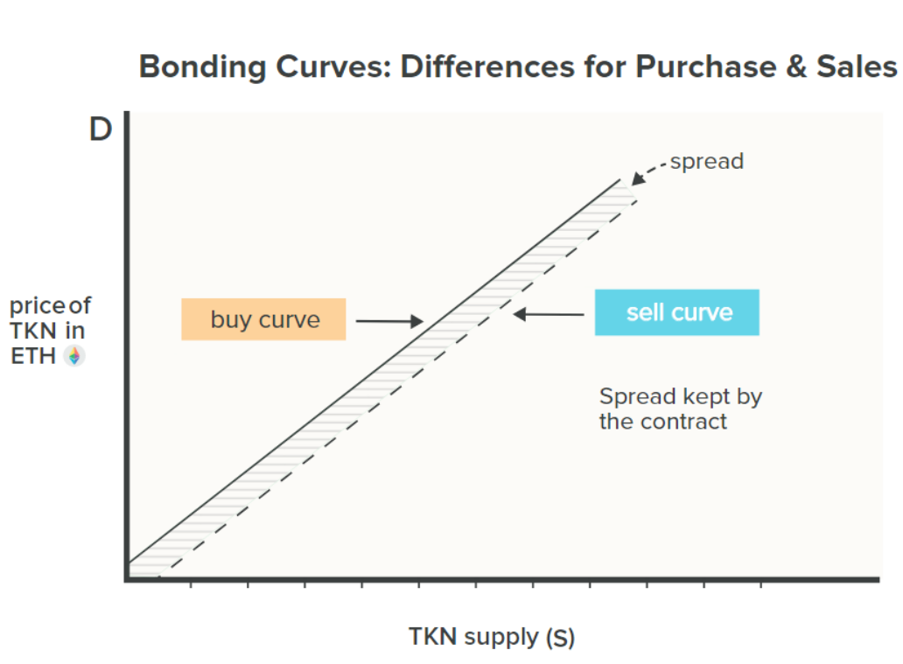


### Incentives

#### Types of incentives
- Two categories of incentives: **staked incentives** and **direct incentives**
- Staked incentives apply to a balance of tokens custodied in a ```smart contract```.
- Direct incentives apply to users within the system who do not have a custodied balance.

#### Staking rewards
- A staking reward is a positive staked incentive by which a user receives a bonus in his token balance based on the stake she has in the system.
- Several verticals of incentive customization are possible:
    - Stake requirement options:
        - minimum threshold or applied to all staked balances on a pro rata basis
    - Reward options:
        - Fixed payout or pro rata payout
        - Same token type as staked or a distinct token

#### Staking Rewards Examples
- The Compound protocol issues staking rewards on user balances that are custodied in a borrowing or lending position. These rewards are paid in a separate token (COMP) funded by custodied COMP, which has a fixed supply, and applied to all staked balances on a pro
rata basis.
- The Synthetix protocol issues staking rewards on staked SNX, its protocol token which has unlimited supply. The rewards are paid in SNX, funded by inflation, and issued only if the user meets a minimum-collateralization-ratio threshold.

#### Slashing
- Slashing is the ```removal of a portion of a user’s staked balance```, thereby creating a negative staked incentive.
- Slashing occurs as the result of an undesirable event.
- A slashing condition is a mechanism that triggers a slashing.
- Slashing customization
    - Removed funds options:
        - Complete or partial slashing
    - Slashing condition options:
        - Undercollateralization triggers liquidation
        - Detectable malicious behavior by user
        - Change in market conditions triggers necessary contraction
#### Slashing example
- With collateralized loans, one slashing mechanism is liquidation
- In a liquidation, potential liquidators receive a direct incentive to execute the liquidation through auctioning or directly selling the
collateral; the balance of funds remaining after the liquidation stays with the original owner.

#### Direct rewards and keepers
- Direct rewards are positive incentives that include payments or fees associated with user actions.
- Ethereum interactions begin with a transaction, and all transactions begin with an externally owned account.
- An EOA, whether controlled by a human user or an off-chain bot, is (importantly) off chain.
- Thus autonomous monitoring of market conditions is either expensive (costs gas) or technically infeasible.
- As a result, no transaction happens automatically on Ethereum without being purposely set in motion.
- The classic example of a transaction that must be set in motion is when a collateralized debt position becomes undercollateralized.
- This use case does not automatically trigger a liquidation; the EOA must trigger the liquidation.
- For this use case and others, EOAs generally receive a directincentive to trigger the contract.
- The contract then evaluates the conditions and liquidates or updates if everything is as expected.

#### Keeper
- A keeper is a class of EOA incentivized to perform an action in a DeFi protocol or other dApp.
- A keeper is rewarded by receiving a fee, either ```flat or percentage of the incented action```.
- Keeper rewards may also be structured as an auction to ensure competition and best price.
- Keeper auctions are very competitive because the information available in the system is almost entirely public.

#### Fees
- Fees are typically a funding mechanism for the features of the system or platform.
- They can be flat or percentage based, depending on the desired incentive. Fees can be imposed as a direct negative incentive or can be accrued on staked balances.
- Accrued fees must have an associated staked balance to ensure the user pays them.
- Given the pseudonymous anonymous nature of Ethereum accounts—all that is known about an Ethereum user is his wallet balance and interactions with various contracts on Ethereum—the imposition of fees is a design challenge.
- If the smart contract is open to any Ethereum account, the only way to guarantee off-chain enforcement or legal intervention is for all
debts to be backed by staked collateral, which is transparent and enforceable.
- The challenges created by anonymity make other mechanisms, such as reputation, unsuitable alternatives to staked balances.


### Swap
#### What is a swap?
- A swap is simply the ```exchange of one type of token to another```.
- There are a number of ways to do this
- Most use a centralized exchange like Coinbase or Coinbase Pro
- The key benefit of **swapping** in ```DeFi``` is that it is **atomic and noncustodial**.
- Funds can be custodied in a smart contract with withdrawal rights that can be exercised at any time before the swap is completed.
- If the swap does not complete, all parties involved retain their custodied funds.
- The swap only executes when the exchange conditions are agreed to and met by all parties, and are enforced by the smart contract.
- If any condition is not met, the entire transaction is cancelled. A platform that facilitates token swapping on Ethereum in a noncustodial fashion is a **decentralized exchange (DEX)**.
- There are two ```primary mechanisms for DEX liquidity```: one is an **order-matching** approach and the other is an **Automated Market Maker**.

#### Order book matching
- ```Order-book matching``` is a system in which all parties must agree on the ```swap exchange rate```.
- Market makers can post bids and asks to a DEX and allow takers to fill the quotes at the pre-agreed-upon price.
- Until the offer is taken, the market maker retains the right to remove the offer or update the exchange rate as market conditions change.
- A leading example of a fully on-chain order book is [Kyber](https://kyber.network/).
- “KyberSwap is a ```non custodial platform```. It means you are in total control of your funds. In a typical centralized exchange - Before placing any trade, you are first required to deposit your funds to exchange. In KyberSwap you do not need to deposit any funds. Just connect your Ethereum wallet and place a trade directly from your wallet.”


#### Order book matching issues
- The order-matching approach is ```expensive and inefficient``` because **each update requires an on-chain transaction**.
- An insurmountable inefficiency with an order-book matching is that both counterparties must be willing and able to exchange at the
agreed-upon rate for the trade to execute.
- This requirement creates limitations for many smart contract applications in which demand for exchange liquidity cannot be dependent on a counterparty’s availability.


#### Automated Market Makers (AMMs)
- An ```Automated Market Maker (AMM)``` is a **smart contract** that holds assets on both sides of a trading pair and continuously quotes a
price for buying and for selling.
- Based on executed purchases and sales, the contract updates the asset size behind the bid and the ask and uses this ratio to define its
pricing function.
- The contract can also take into account more complex data than relative bid/ask size when determining price.
- From the contract's perspective, the price should be ```risk-neutral``` where it is indifferent to buying or selling.

#### Naïve AMM
- A naive AMM might set a **fixed price ratio** between two assets.
- With a fixed price ratio, when the market price shifts between the assets, the more valuable asset would be drained from the AMM and arbitraged on another exchange where trading is occurring at the market price.
- The AMM should have a pricing function that can converge on the market price of an asset so that it becomes more expensive to purchase an asset from the trading pair as the ratio of that asset to the others in the contract decreases.

#### Advantages of AMM
- Main benefit is the constant availability 24/7 and that a traditional counterparty is not necessary to execute a trade.
- These provisions are very important for smart contracts and DeFi development because of the guarantee that a user can exchange
assets at any moment if necessary.
- A user maintains custody of her funds until she completes the trade, hence, counterparty risk is zero.

#### Composable liquidity of AMM
- An additional benefit is **composable liquidity**, which means ```any exchange contract can plug into the liquidity and exchange rates of any other exchange contract```.
- AMMs make this particularly easy because of their guaranteed availability and their allowing one-sided trading against the contract.
- Composable liquidity fits with concept of DeFi Legos.


#### Impermanent Loss of AMM
- One drawback to an AMM is the concept of ```impermanent loss```, the opportunity-cost dynamic between offering assets for exchange and
holding the underlying assets to potentially profit from the price movement.
- The loss is impermanent because it can be recovered if the price reverts to its original level.

Impermanent loss example
    - Initial conditions in market:
        - Token A = 1 ETH and
        - Token B = 1 ETH
        - AMM has an exchange rate of 1:1
        - Contract has 100 A and 100 B. So the total value of escrow is 200 ETH

    - New conditions. Both tokens appreciate in value. Now:
        - Token A = 2 ETH and
        - Token B = 4 ETH
        - AMM has an exchange rate of 1:1
        - Traders buy token A on open market (like Coinbase) and exchange it in the AMM for B – draining all the B.
        - Contract left with 200 A and zero B.
        - Value = 400 ETH
        - However, if there was no exchange in the AMM, the value would be 600 ETH
    - Impermanent loss is the difference 600 – 400 = 200 ETH
    - This simplified example had an exchange rate of 1:1

Impermanent loss Uniswap v2 example:
    - New market prices are 1 ETH = 400 DAI
    - Arbitrageurs see the opportunity and buy DAI in open market and use DAI to withdraw ETH. The exchange price depends on the ratio of   price whereas the liquidity (10,000) remains constant.
    - Arbitrageurs will drain 5 ETH so the pool now has 5 ETH and 2,000 DAI. Notice liquidity is still 10,000 and the new ratio is 1:400 (reflecting market prices).
    - Alicia owns 10% and withdraws all her funds from the pool. That will be 0.5 ETH and 200 DAI.
    - USD value is $400 ($400 x 0.5 + $1 x 200)
    - Her original investment was $200
    - However, if she did not deposit into the pool, the value of the assets would have been $500 ($400 x 1 + $1 x 100)
    - The impermanent loss is $100 ($500-$400)
    - Note that there is a profit overall plus we are not accounting for the fees that Alicia would earn for providing liquidity


#### Impermanent loss features
- Impermanent loss occurs for any shift in price and liquidity, because the contract is structured to sell the appreciating asset and to buy
the depreciating asset.
- An important feature of impermanent loss is path independence. In our example, it is irrelevant whether 1 or 100 traders consumed all
the liquidity.
- The final exchange rate and contract asset ratios yield the same impermanent loss regardless of the number of trades or the direction of the trades.
- Because of path independence, impermanent loss is minimized on trading pairs that have correlated prices (mean-reverting pairs).
- Thus, stablecoin trading pairs are particularly attractive for AMMs.


#### Orderly Cryptocurrency?
- “**Arbitrageable**”: Cryptocurrencies have low transaction costs, globally fungible
    - In theory, they should have tight spreads, low volume, orderly markets
- Instead:
    - BTC prices differ by hundreds of dollars across exchanges
    - BTC daily volume of $25bn, 15% of entire market cap
        - Annual volume is 55x the market cap
        - Annual volume of Apple is only 1.7x market cap
- How can this be?

### Fake Exchanges
#### Why would exchanges exaggerate volume
- Initial Coin and Exchange Offerings (ICOs/IEOs): Showing up at the top of these lists can attract coins to list on your
exchange
- “Fake it till you make it”: Crypto traders may be attracted to trade on your exchange, thereby increasing the “true”volume
- Over 90% of trading volume is fake!
    - Fake transactions can either occur off-chain (within addresses internally) or on-chain (pay transaction and show up on blockchain)
    - How can we identify a fake exchange?

#### What a Normal Exchange Looks Like
Key Elements
- **Order Book**: List of trades (size and prices) that have been submitted but not yet filled
    - Orders in red are to sell; in green are to buy
    - Spread is given by difference between minimum sell price and maximum buy price
    - Trades occur when someone is willing to sell at a price at which someone wants to buy
    - Example: 5.601 BTC being offered for sale at $10,336.30 per BTC. Buyer wants to purchase 0.4045 BTC at $10,335.05. The spread between the cheapest sale price and highest purchase price is $1.19.
- **Low spread**: The spread of BTC is $1.19 (only 0.01% of the price)
    - Spread of Apple is $0.15 (0.05% of price)
- **Round numbers**: Many orders are for round numbers of BTC, evidence of a normal exchange
- **Trade History**: Each row represents a trade that was fulfilled. Trade size, price, and time are listed.
    - Rows in green lifted the price (i.e., the trade occurred at a price higher than the price at the time of trade), while those in red reduced the price
- **Streaky**: There are often several price raises in a row, reflecting more buying then selling activity at this point in time (upward price pressure)
- **Round numbers**: Again, we see many transactions occurring at round decimals (0.03, 0.05, etc.). This is evidence of a normal exchange
- **Price History**: Red and green bars reflecting price movements every interval (typically 5-10 minutes)
    - Notice that it is again streaky
- **Trading Volume**: Gray bars at the bottom show amount of BTC traded each interval

#### How Much Volume is Fake
- Only 4.5% of Total Volume is Real: This reduces BTC daily volume from $25bn “fake” volume to just over $1bn actual volume
- Annual “real” volume is 1.7x market cap
- Same as Apple’s turnover
- Cryptocurrency markets look much more orderly when correcting for fake volume
- Being able to distinguish fake volume crucial to understanding centralized exchange

### Collateralized Loans
#### Role of Debt and Lending in DeFi
- ```Debt and lending``` are perhaps the **most important financial mechanisms that exist in DeFi**, and in traditional finance.
- Any loan of non-zero duration (e.g., foreshadowing flash loan) must be backed by an equivalent or excess amount of collateral.
- Requiring collateral contractually prevents a counterparty from defaulting.
- An uncollateralized mechanism raises the risk that a counterparty could steal funds, especially in an open and anonymous system such as Ethereum.

#### Foreclosure Risk
- A risk of overcollateralized positions is that the ```collateral becomes less valuable``` than the debt, leading to a foreclosure without an option for recovery.
- Therefore, **more-volatile types of collateral require larger collateralization ratios** in order to mitigate this risk.

#### Liquidation
- To avoid liquidation it is imperative that debt remain overcollateralized by a margin sufficiently large that moderate price volatility does not place the collateral value in jeopardy.
- Smart contracts commonly define a **minimum collateralization threshold** below which the collateral can be liquidated and the position closed.
- The collateral could be auctioned or directly sold on a DEX, likely with an AMM, at the market price.

#### Liquidation trigger
- **Positions in the Ethereum blockchain cannot be liquidated automatically**, so ```an incentive is needed```.
- The incentive often takes the form of a ```percentage fee allocated to an external keeper``` who is able to liquidate the position and collect the reward.
- Any **remaining collateral** is left to the ```original holder of the position```.
- In some cases, the system will ```leave all remaining collateral to the keeper as a stronger incentive```.
- Because the penalty for liquidation is high and most collateral types are volatile, platforms generally allow users to top up their collateral to maintain healthy collateralization ratios.

#### Collateralization can back a token
- An implication of collateralized loans and token supply adjustment is that ```collateralization can back the value of a synthetic token```.
- The synthetic token is an asset created and funded by a debt, which is the requirement to repay the synthetic token in order to reclaim
the collateral.
- The synthetic token can have a utility mechanism or represent a complex financial derivative, such as an option or bond (e.g., Synthetix Synth and Yield yToken). A stablecoin that tracks the price of an underlying asset can also be a synthetic token of this type (e.g., MakerDAO DAI).

### Flash Loans
#### Traditional finance
- A financial primitive that uniquely exists in DeFi and dramatically broadens certain types of financial access is a ```flash loan```.
- In traditional finance, a lender is compensated for providing the capital and bearing the risk of default by the interest amount charged over the life of the loan.
- The interest rate is typically higher the longer the duration of the loan, because the longer time to repay exposes the lender to greater risk that the borrower may default.

#### Zero-duration loans
- Reversing the concept leads to the conclusion that shorter-term loans should be less risky and therefore require less compensation for the lender.
- A **flash loan is an instantaneous loan paid back within the same transaction**.
- A flash loan is similar to an overnight loan in traditional finance, but with a crucial difference—repayment is required within the transaction and ```enforced by the smart contract```.

### Risk of flash loans
- A thorough understanding of an Ethereum transaction is important for understanding how flash loans work.
- One clause in the transaction is vital: if the loan is not repaid with required interest by the end of the transaction, the whole process
reverts to the state before any money ever left the lender’s account.
- In other words, **either the user successfully employs the loan for the desired use case and completely repays it in the transaction or the transaction fails and everything resets as if the user had not borrowed any money**.
- Flash loans essentially have zero counterparty risk or duration risk.
- They allow a user to ```take advantage of arbitrage opportunities``` or ```refinance loans without pledging collateral```.
- This capability allows anyone in the world to have access to opportunities that typically require very large amounts of capital investment.
- This type of innovations that cannot exist in the world of traditional finance.
- However, these are not “risk free” because of **smart contract risk**.

### MetaMask Wallet
- MetaMask is a cryptocurrency wallet that is used to interface with the Ethereum-based Apps


## MakerDAO - Credit/Lending: MakerDAO

### Background
- As the name suggests, ```MakerDAO``` is a **decentralized autonomous organization**.
- The primary value-add is the creation of a **crypto-collateralized stablecoin**, ```pegged to USD``` called DAI. This means the system can run completely from within the Ethereum blockchain without relying on outside centralized institutions to back, vault and audit the stablecoin.
- Two token model: **DAI = stablecoin** and **MKR = governance token**

### Mechanics of DAI
- DAI is generated as follows: A user can deposit ETH or other supported ERC-20 assets into a ```Vault```.
- A **Vault** is a **smart contract that escrows collateral and keeps track of the USD-denominated value of the collateral**.
- The user can then ```mint``` DAI up to a ```certain collateralization ratio``` on their assets.
- This creates a “debt” in DAI that must be paid back by the Vault holder.
- The DAI is the corresponding asset that can be used any way the Vault holder wishes.
    - Example 1: user can sell the DAI for cash
    - Example 2: use can use DAI to buy more of the collateral asset, and repeat the process, to create a levered position.
- Due to the volatility of ETH and most collateral types, the collateralization requirement is far in excess of 100% and usually in the 150-200% range.

### Collateralized Debt Position (CDP)
- The basic idea is not new; a homeowner in need of some liquidity can pledge their house as collateral to a bank and receive a mortgage loan structured to include a cash takeout.
- The price volatility of ETH is much greater than for a house and, as such, ```collateralization ratios``` for the ETH-DAI contract are higher.
- In addition, no centralized institution is necessary as everything happens within the Ethereum blockchain.
- Example
    - Suppose an ETH owner needs liquidity but does not want to sell her ETH because she thinks it will appreciate.
    - The situation is analogous to the homeowner who needs liquidity but does not want to sell her house.
    - Let’s say an investor has 5 ETH at a market price of $200 (total value of $1,000).
    - If the collateralization requirement is 150%, then the investor can mint up to 667 DAI ($1,000/1.5 with rounding).
    - The collateralization ratio is set high to reduce the probability that the loan debt exceeds the collateral value, and for the DAI token to be credibly pegged to the USD, the system needs to avoid the risk that the collateral is worth less than $1=1 DAI.
    - Given the collateralization ratio of 1.5, it would be unwise to mint the 667 DAI because if the ETH ever dropped below $200, the contract would be undercollateralized, the equivalent of a “margin call”.
    - We are using traditional finance parlance, but in DeFi there is no communication from your broker about the need to post additional margin or to liquidate the position and also no grace period.
    - Liquidation can happen immediately.

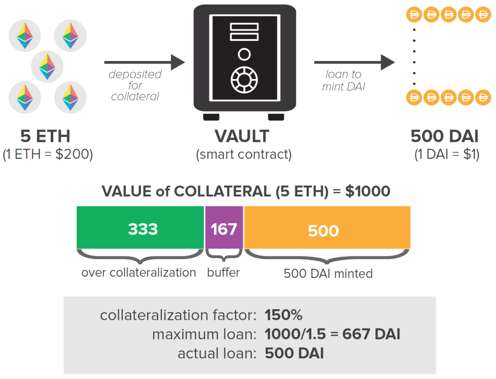

#### Credit/Lending: MakerDAO
- Secanrio 1:
    - Suppose ETH rises by 50% so collateral is worth $1,500.
    - The investor can increase the size of her loan.
    - To maintain the collateralization of 200%, the investor can mint an extra 250 DAI.

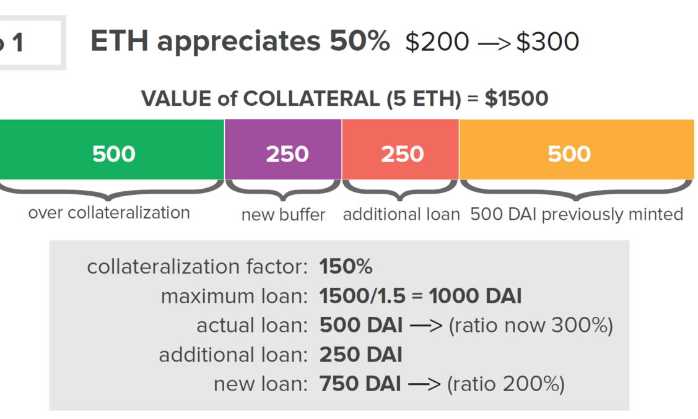

- Scenario 2:
    - Suppose the value of the ETH drops by 25% from $200 to $150.
    - In this case, the value of the collateral drops to $750 and the collateralization ratio drops to 1.5 ($750/1.5 = 500).

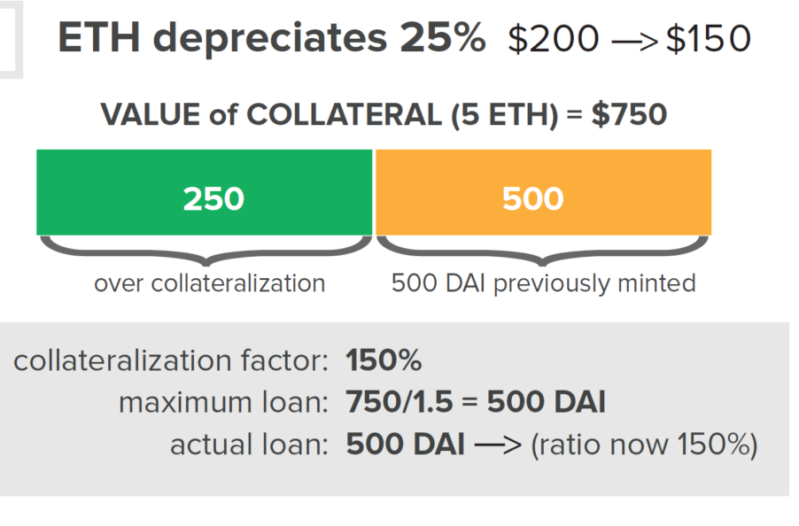

- Example
Suppose the value of the ETH drops by 25% from $200 to $150.
- The Vault holder faces three scenarios.
  1. She can increase the amount of collateral in the contract (by, for example, adding 1 ETH).
  2. She can use the 500 DAI to pay back the loan and repatriate the 5 ETH. These ETH are now worth $250 less, but the depreciation in value would have happened irrespective of the loan.
  3. The loan is liquidated by a keeper (any external actor).

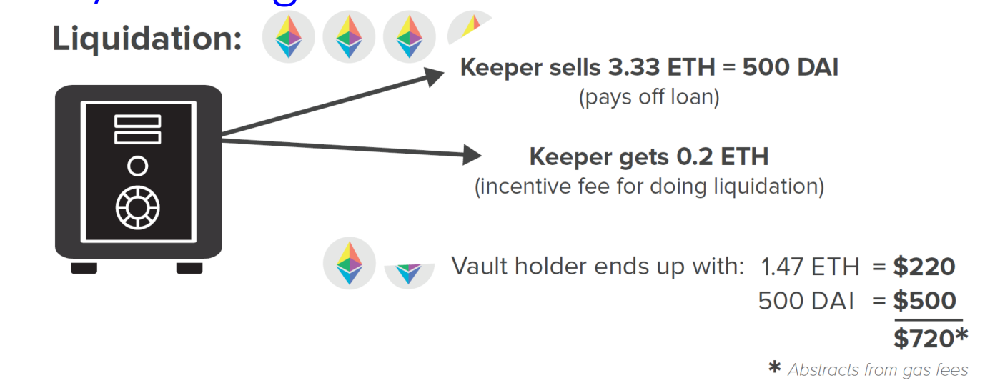

- The keeper auctions the ETH for enough DAI to pay off the loan.
- 3.33 ETH are sold and 1.47 ETH returned to the Vault holder.
- Keeper gets incentive fee of 0.2 ETH
- Vault holder has 500 DAI worth $500 and 1.47 ETH worth $220.


### Stability forces
- Two forces in this process reinforce the stability of DAI.
  1. **Overcollateralization**.
  2. **Market actions**. In the liquidation, ETH are sold and DAI are purchased, which exerts positive price pressure on DAI.

### Maintaining the Peg
- The viability of the MakerDAO ecosystem critically depends on ```DAI``` maintaining a ```1:1 peg to the USD```.
- Various mechanisms are in place to incentivize demand and supply in order to drive the price toward the peg.
- The primary mechanisms are: the **debt ceiling**, **stability fee**, and **DAI Savings Rate (DSR)**.
- These parameters are controlled by holders of the ```governance token Maker (MKR)``` and ```MakerDAO governance```.


#### Stability Fee
- The Stability Fee is ```a variable interest rate``` paid in DAI by ```Vault holders``` on any ```DAI debt they generate```.
- The ```interest rate can be raised or lowered``` (even to a negative value) to incentivize the generation or repayment of DAI to drive its price toward the peg.

#### DAI Savings Rate (DSR)
- The ```Stability Fee funds the DSR```, a variable rate any DAI holder can earn on their DAI deposit.
- The DSR compounds on a ```per-block basis```. The **Stability Fee**, which **must always be greater or equal to the DSR**, is enforced by the smart contracts powering the platform.

#### DAI Debt Ceiling
- Lastly, a ```smart contract–enforced DAI debt ceiling``` can be adjusted to allow for more or less supply to meet the current level of demand.
- If the protocol is at the ```debt ceiling```, **no new DAI is able to be minted in new Vaults until the old debt is paid or the ceiling is raised**.

### Liquidation
- When a position is deemed to be under the liquidation ratio, a keeper can initiate an auction (sell some of the ETH collateral) to liquidate the position and close the Vault holder’s debt.
- The Liquidation Penalty is calculated as a percentage of the debt and is deducted from the collateral in addition to the amount needed to close the position.

#### Large drops in the value of collateral
- If the collateral drops so far in value that the DAI debt cannot be fully repaid, the position is closed, and the protocol accrues what is known as ```Protocol Debt```.
- A ```buffer pool of DAI``` exists to cover Protocol Debt, but in certain circumstances the debt can be too great for even the buffer pool to cover.
- The solution involves the ```governance token MKR``` and the governance system.

### Governance
- The ```MKR``` token controls ```MakerDAO```.
- Holders of the token have the right to ```vote on protocol upgrades, including supporting new collateral types and tweaking parameters such as collateralization ratios```.
- ```MKR holders``` are expected to make decisions in the best financial interest of the platform.
- Their incentive is that a healthy platform should increase the value of their share in the platform's governance.

#### Global settlement
- For example, poor governance could lead to a situation where the buffer pool is not sufficient to pay back the Protocol Debt.
- In this case, newly minted MKR tokens are auctioned off in exchange for DAI and the DAI are used to pay back the Protocol Debt.
- This process is Global Settlement, a safety mechanism intended for use only when all other measures have failed.
- Global Settlement dilutes the MKR share, which is why stakeholders are incentivized to avoid it and keep Protocol Debt to a minimum.

#### Decisions of MKR holders
- Votes by the MKR holders can change any of the parameters available on the platform, e.g., supporting new collateral types for Vaults
- MKR holders could also vote to ```pay themselves a dividend funded by the spread between the interest payments paid by Vault holders and the DAI Savings Rate```.
- The reward of receiving this dividend would need to be weighed against any negative community response that might decrease the value of the protocol and the MKR token.

#### Why DAI is attractive
- Importantly, users can purchase and utilize DAI without having to go through the process of generating it in a Vault—they can simply purchase DAI on an exchange.
- Therefore, users do not need to know the underlying mechanics of how DAI are created.
- Holders can easily ```earn the DAI Savings Rate``` by using the protocol.
- More technologically and financially sophisticated users can use the MakerDAO web portal to generate Vaults and create DAI to get liquidity from their assets without having to sell them.
- It is easy to sell DAI and purchase an additional amount of the collateral asset to get leverage.

#### Drawback of DAI
- DAI supply is always constrained by demand for ETH-collateralized debt.
- No clear arbitrage loop exists to maintain the peg.
- For example, the stablecoin USDC is always redeemable by Coinbase for $1, with no fees. Arbitrageurs have a guaranteed (assuming solvency of Coinbase) strategy in which they can buy USDC at a discount or sell it at a premium elsewhere and redeem on Coinbase.
- This is not true for DAI. Irrespective of any drawbacks, the simplicity of DAI makes it an essential building block for other DeFi applications.

Traditional Finance Problem | MakerDAO Solution |
---|---|
Centralized Control: Interest rates are influenced by the US Federal Reserve and access to loan products controlled by regulation and institutional policies.|MakerDAO platform is openly controlled by the MKR holders.|
Limited Access: Obtaining loans is difficult for a large majority of the population. | Open ability to take out DAI liquidity against an overcollateralized position in any supported ERC-20 token. Access to a competitive USD-denominated return in the DSR. |
Inefficiency: Acquiring a loan involves costs of time and money. | Instant liquidity at the push of a button with minimal transaction costs. | 
Lack of Interoperability: Cannot trustlessly use USD or USD-collateralized token in smart contract agreements. | Issuance of DAI, a permissionless USD-tracking stablecoin backed by cryptocurrency. DAI can be used in any smart contract or DeFi application.|
Opacity: Unclear collateralization of lending institutions. | Transparent collateralization ratios of vaults visible to entire ecosystem.|


## Compound

### What is Compound?
- Compound is a **lending market** that offers several different ```ERC-20 assets``` for **borrowing and lending**.
- All the tokens in a single market are pooled together so ```every lender earns the same variable rate and every borrower pays the same variable rate```.

### Overcollateralization
- The concept of a credit rating is irrelevant, and because Ethereum accounts are pseudonymous, enforcing repayment in the event of a loan default is virtually impossible.
- For this reason, all loans are ```overcollateralized``` in a collateral asset different from the one being borrowed.
- If a borrower falls below their collateralization ratio, their ```position is liquidated``` to pay back their debt.
- The debt can be liquidated by a ```keeper```. The keeper receives a bonus.

### Collateralization ratios and factors
- The collateralization ratio is calculated via a ```collateral factor```.
- Each ERC-20 asset on the platform has its own collateral factor ranging from zero to 90.
- A collateral factor of zero means an asset cannot be used as collateral.
- The required collateralization ratio for a single collateral type is calculated as 100 divided by the collateral factor.
- **Volatile assets generally have lower collateral factors**, which **mandate higher collateralization ratios** due to increased risk of a price movement that could lead to undercollateralization.
- An account can use ```multiple collateral types``` at once, in which case the **collateralization ratio is calculated as 100 divided by the weighted average of the collateral types by their relative sizes** (denominated in a common currency) in the portfolio.


### Collateralization ratio is like a reserve multiplier
- The ```collateralization ratio``` is similar to a reserve multiplier in traditional banking, constraining the ```amount of “borrowed” dollars that can be in the system relative to the “real” supply```.
- For instance, there is occasionally more DAI in Compound than is actually supplied by MakerDAO, because users are borrowing and
resupplying or selling to others who resupply.
- Importantly, all MakerDAO supply is ultimately backed by real collateral and there is no way to borrow more collateral value than has been supplied.

- Example
    - An investor deposits 100 DAI with a collateral factor of 90.
    - This transaction alone corresponds to a required collateralization ratio of 111%.
    - Assuming 1 DAI = $1, the investor can borrow up to $90 worth of any other asset in Compound.
    - If she borrows the maximum, and the price of the borrowed asset increases at all, the position is subject to liquidation.
    - Suppose she also deposits two ETH with a collateral factor of 60 and a price of $200/ETH.
    - The total supply balance is now $500, with 80% being ETH and 20% being DAI. The required collateralization ratio is 100/(0.8*60 + 0.2*90) = 151%.

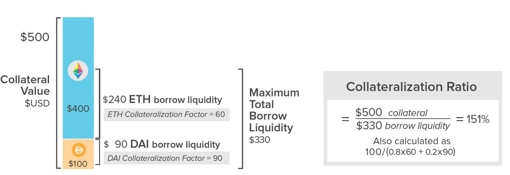


### Supply and borrow rates
- The supply and borrow interest rates are compounded every block (approximately 15 seconds on Ethereum producing approximately continuous compounding) and are determined by the utilization percentage in the market.
- Utilization is calculated as ```total borrow/total supply```.
- The ```utilization rate``` is used as an input parameter to a formula that determines the interest rates.
- The remaining parameters are set by ```Compound Governance```.


### Borrow rate formula
- The formula for the borrow rate generally is ```an increasing linear function with a y-intercept``` known as the base rate that represents
the borrow rate at 0% borrow demand and a slope representing the rate of change of the rates.
- These ```parameters are different for each ERC-20``` asset supported by the platforms.
- Some markets have more advanced formulas that include a **kink**. ```A kink is a utilization ratio beyond which the slope steepens```.
- These formulas can be used to reduce the cost of borrowing up to the kink and then increase the cost of borrowing after the kink to incentivize a minimum level of liquidity.


### Supply interest rate formula
- **Supply interest rate = (borrow interest rate x utilization ratio)** so borrow payments can fully cover the supplier rates.
- The ```reserve factor``` is a percentage of the borrow payments not given to the suppliers and instead set aside in a reserve pool that acts as insurance in that case a borrower defaults.
- In an extreme price movement, many positions may become undercollateralized in that they have insufficient funds to repay the suppliers. In the event of such a scenario, the suppliers would be repaid using the assets in the reserve pool.

- Example
    - In the DAI market, 100 million is supplied and 50 million is borrowed.
    - Suppose the base rate is 1% and the slope is 10%.
    - At 50 million borrowed, utilization is 50%.
    - The borrow interest rate is then calculated to be 0.5*0.1 + 0.01 = 0.06 or 6%.
    - The maximum supply rate (assuming a reserve factor of zero) would simply be 0.5*0.06 = 0.03 or 3%.
    - The borrow rate is not a marginal rate – it is a rate for all borrowers.
    - For example, suppose an initial borrower does $25 million. The rate would be .25*0.1 + 0.01 = 3.5%.
    - Then suppose another borrower enters the market with another $25 million loan.
    - The rate increases to 6% for all borrowers.
    - If the reserve factor is set to 10, then 10% of the borrow interest is diverted to a DAI reserve pool, lowering the supply interest rate to 2.7%. 0.5*0.06*(1-0.10) = 0.027 or 2.7%.

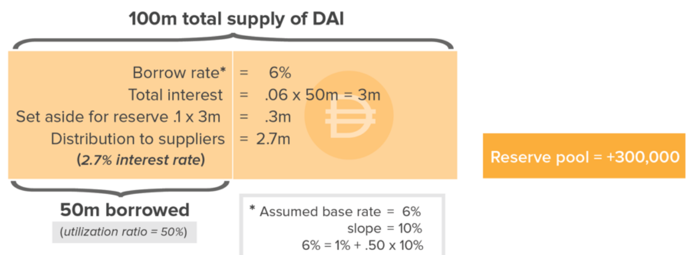


    - Another way to think about the supply interest rate is that the 6% borrow interest of 50 million is equal to 3 million of borrow payments.
    - Distributing 3 million of payments to 100 million of suppliers implies a 3% interest rate to all suppliers. With 10% diverted (300,000), then there is on 2.7 million of payments
    - Suppose 100 million DAI is supplied and 90 million DAI is borrowed, a 90% utilization.
    - The kink is at 80% utilization, before which the slope is 10% and after which the slope is 40%, which implies the borrow rate will be much higher if the 80% utilization is exceeded.


- Example with kink
    - The base rate remains at 1%.
    - The borrow interest rate = 0.01 (base) + 0.8*0.1 (pre-kink) + 0.1*0.4(post-kink) = 13%.
    - The supply rate (assuming a reserve factor of zero) is 0.9*0.13 = 11.7%.


### Advantages of Compound
- Unlock value of asset without selling it – like a HELOC
- Easily engineer levered long or short positions
- Suppose you are bearish on price of ETH
    - Deposit stablecoin like USDC or DAI
    - Borrow ETH
    - Sell ETH for stablecoin
    - If price of ETH falls, you can use your stablecoin to buy (cheap) ETH to pay off debt
- Levered positions are possible too
- Suppose you are bearish on price of ETH
    - Deposit stablecoin like USDC or DAI
    - Borrow ETH
    - Sell ETH for stablecoin
    - Deposit additional stablecoin from your sale
    - Borrow more ETH
    - Sell additional ETH for stablecoin
    - If price of ETH falls, you can use your stablecoin to buy (cheap) ETH to pay off debt


### cTokens
- The Compound protocol must ```escrow tokens as a depositor in order to maintain that liquidity for the platform itself and to keep track of each person’s ownership stake``` in each market.
- A naive approach would be to keep track of the number inside a contract.
- A better approach would be to ```tokenize the user's share```.
- Compound does this using a **cToken**, and this is one of the platform’s important innovations.
#### cTokens are Minted and Burned
- Compound’s cToken is an ```ERC-20``` in its own right that represents an ownership stake in the underlying Compound market.
- For example, cDAI corresponds to the Compound DAI market and cETH corresponds to the Compound ETH market.
- Both tokens are ```minted and burned ```in proportion to the funds added and removed from the underlying market as a means to track the amount belonging to a specific investor.

#### cTokens Can be Traded
- Given interest payments continually accrue to suppliers, these tokens are always worth more than the underlying asset.
- cTokens can be traded on their own like a normal ```ERC-20``` asset.
- Other protocols can ```seamlessly integrate with Compound simply by holding cTokens``` and allows users to deploy their cTokens directly into other opportunities, such as using a cToken as collateral for a MakerDAO Vault.
- Instead of using ETH only as collateral, an investor can use ```cETH``` and ```earn lending interest on the ETH collateral```.

- Example
    - Assume there are 2,000 DAI in the Compound DAI market and a total 500 cDAI represents the ownership in the market; this ratio of cDAI to DAI is not determinative and could just as easily be 500,000 cDAI.
    - 
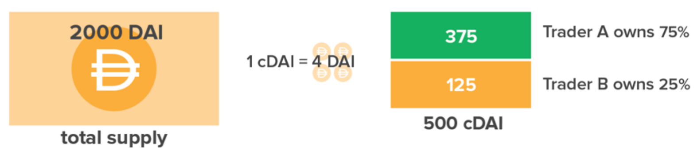

    - If a trader comes in and deposits 1,000 DAI, the supply increases by 50% (and Compound mints 50% or 250 cDAI)
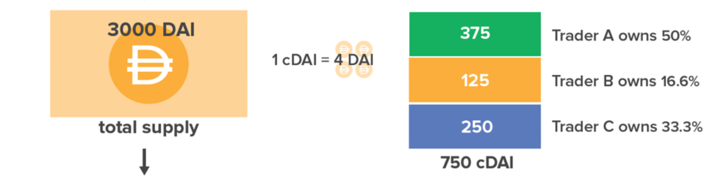
    - Currently, 1 cDAI = 4 DAI, but after interest accrues the ratio will change. Let interest = 10%, at year end, 3,300 DAI. Trader redeems 250 cDAI for 1,100 DAI
    - 
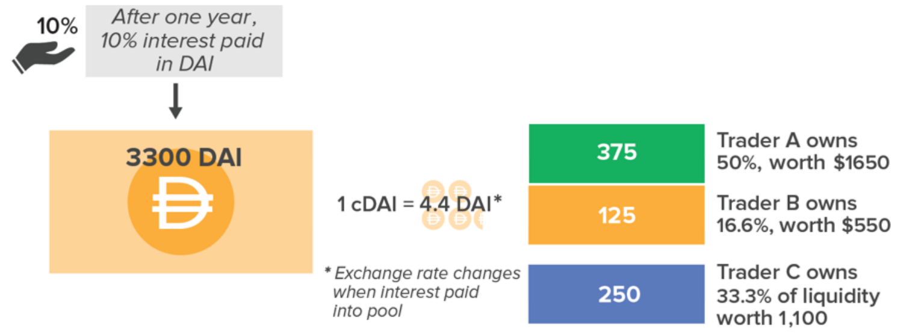

    - Note that the trader can deploy cDAI in the place of DAI so the DAI is not sitting idle but earning interest via the Compound pool.
    - For example, the trader could deploy cDAI as the necessary collateral to open a perpetual futures position on dYdX or she could market make on Uniswap using a cDAI trading pair (discussed later).


### Compound Governance parameters
- The many different parameters of Compound’s functionality, such as the collateral factor, reserve factor, base rate, slope, and kink, can all be tuned.
- The ```entity capable of tuning these parameters is Compound Governance```.
- **Compound Governance** has the power to change parameters, add new markets, freeze the ability to initiate new deposits or borrows in a market, and even upgrade some of the contract code itself.
- Importantly, **Compound Governance cannot steal funds or prevent users from withdrawing**.
- In the early stages of Compound's growth, governance was controlled by developer admins, similar to any tech startup.
- Technically, this meant that the first version of Compound was not fully decentralized
- A strong development goal of Compound, as with most DeFi protocols, was to ```remove developer admin access and release the protocol to the leadership of a DAO via a governance token```.
- The token allowed shareholders and community members to collectively become Compound Governance and propose upgrades or parameter tuning.
- A quorum agreement is required for any change to be implemented.
- The ```quorum rule is a majority of users each of whom holds with a minimum of 400,000 COMP``` (~4% of total eventual supply)
### COMP token
- Compound implemented this new governance system in May 2020 via the COMP token.
- COMP is used to vote on protocol updates such as parameter tuning, adding new asset support, and functionality upgrades (similar to MKR for MakerDAO).
- On June 15, 2020, the 7th governance proposal passed which provided for distributing COMP tokens to users of the platform based on the borrow volume per market.
- The proposal offered an experience akin to a tech company giving its own stock to its users.
- The COMP token is distributed to both suppliers and borrowers, and acts as a subsidization of rates.
- With the release of the token on public markets, COMP’s market cap spiked to over $2 billion.
- The price point of the distribution rate is so high that borrowing in most markets turned out to be profitable.
- This arbitrage opportunity attracted considerable volume to the platform, and the community governance has made and passed several proposals to help manage the usage.

### Other platforms use Compound
- The Compound protocol can no longer be turned off and will exist on Ethereum as long as Ethereum exists.
- Other platforms can easily ```escrow funds in Compound``` to provide additional value to their users or enable novel business models.
- **Easy, instant access to yield or borrow liquidity on different Ethereum tokens** makes Compound an important platform in DeFi.

### Fair lotteries
- (PoolTogether)[https://pooltogether.com/] is a no-loss lottery that deposits all user's funds into Compound, but pays the entire pool’s earned interest to a single random depositor at fixed intervals.
- In most lotteries, 30-50% of the lottery sales are tagged for administrative costs and government or charitable use; hence, the expected value of investing $1.00 in a lottery is $0.50-$0.70.
- In a no-loss lottery, all sales are paid out and the expected value is $1.00.

### Comaprison Compound with Traditional Finance


Traditional Finance Problem | Compound Solution |
---|---|
Centralized Control: Borrowing and lending rates are controlled by institutions.| Compound rates are determined algorithmically and gives control of market parameters to COMP stakeholders incentivized to provide value to users.|
Limited Access: Difficulty in accessing high- yield USD investment opportunities or competitive borrowing. | Open ability to borrow or lend any supported assets at competitive algorithmically determined rates (temporarily subsidized by COMP distribution). |
Inefficiency: Suboptimal rates for borrowing and lending due to inflated costs. | Algorithmically pooled and optimized interest rates. | 
Lack of Interoperability: Cannot repurpose supplied positions for other investment opportunities.| Tokenized positions via cTokens can be used to turn static assets into yield-generating assets.|
Opacity: Unclear collateralization of lending institutions. | Transparent collateralization ratios of borrowers visible to entire ecosystem..|


## Aave
### What is Aave?
- Aave, launched in 2017, is a ```lending protocol similar to Compound```.
- More tokens to supply and borrow are offered
- Importantly, the **Aave lending and variable borrowing rates are more predictable, because unlike the volatile COMP token in Compound, no subsidy is involved**.

### Two markets
- The ```first``` is for **more-conventional ERC-20 tokens** similar to those of Compound, supporting assets such as ```ETH, USDC, and DAI```.
- The ```second``` is specific to **Uniswap UNI LP tokens** (discussed later).
- For example, when a user deposits collateral into a Uniswap market, she receives an ```LP token as a Liquidity Provider``` that represents her ownership in the market.
- The ```LP tokens can be deposited in the Uniswap market on Aave to generate additional returns```.

### Flash loans
- Aave charges a fee of ```9 basis points (bps)``` on the ```loan amount to execute a flash loan```.
- The fee is paid to the asset pool and provides an additional return on investment to suppliers, because they each own a pro rata share
of the pool.
- An important ```use case``` for flash loans is that they **allow users quick access to capital as a means to refinance positions**.

- Example
    - Assume the price of ETH is 200 DAI.
    - A user supplies 100 ETH in Compound and borrows 10,000 DAI to lever up and purchase an additional 50 ETH, which the user also
    supplies to Compound.
    - Suppose the borrow interest rate in DAI on Compound is 15% on Aave is 5%.
    - The goal is to refinance the borrowing to take advantage of the lower rate offered on Aave, which is analogous to refinancing a mortgage, a long and costly process in centralized finance.
    - One option is to manually unwind each trade on Compound and re- do both trades on Aave to reconstruct the levered position, but this option is wasteful in terms of exchange fees and gas fees.
    - A flash loan provides an attractive alternative
    - Take out a flash loan from Aave for 10,000 DAI,
    - Use it to pay the debt on Compound,
    - Withdraw the full 150 ETH from Compound
    - Resupply to Aave, and (at 5% APR) against that collateral to repay the flash loan.
    - The latter approach effectively skips the steps of exchanging ETH for DAI to unwind and rewind the leverage.
    - The ```flash loan is a single transaction```.
    - A flash loan used to refinance a position allows for DeFi client applications that let users migrate a levered position from one dApp to another with the single push of a button.

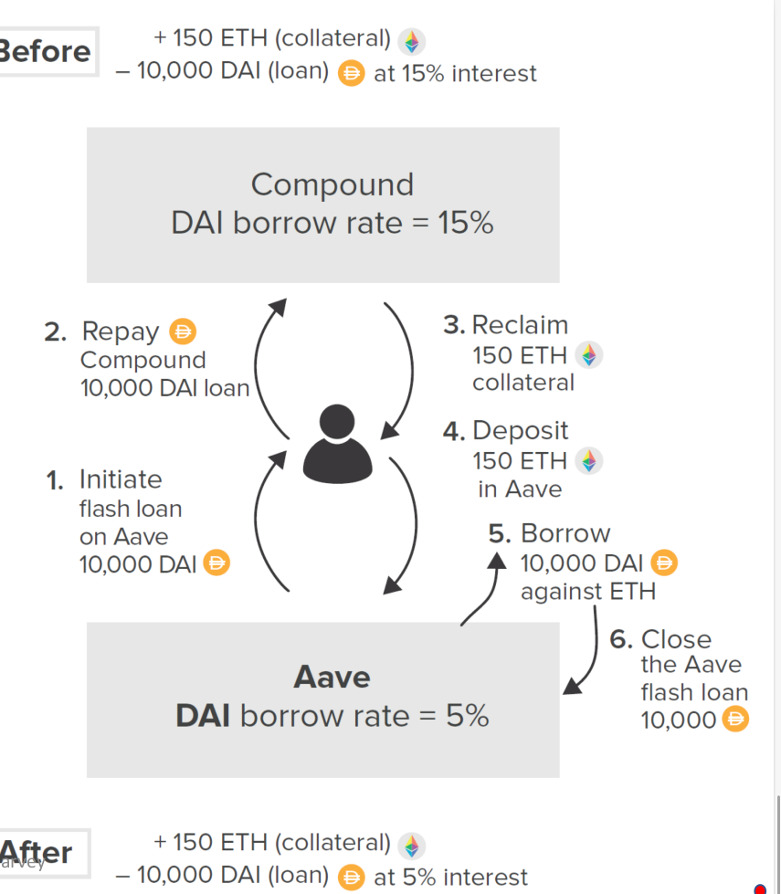

### Stable loan rate
- An Aave innovation (and as of this writing only available on Aave) is a **stable rate loan**.
- The choice of ```“stable”``` intentionally``` avoids the use of “fixed rate”```.
- A borrower has the option to switch between the ```variable rate and the current stable rate```.


### Supply rate is not stable
- The **supply rate is always variable**, because under certain circumstances, such as if all borrowers left the market, it would be impossible to fund a fixed supply rate.
- The suppliers always collectively earn the sum of the stable and variable borrow interest payments minus any fees to the platform.


### Stable rate is not a fixed rate
- The stable rate is not a fixed rate, because the rate is adjustable in extreme liquidity crunches and can be refinanced to a lower rate if
market conditions allow.
- Also, some constraints exist around how much liquidity can be removed at a specific stable rate.
- Algorithmic stable borrowing rates provide value to ```risk-averse``` investors who wish to take on leverage without the uncertainty of a variable-rate position.

### Credit delegation
- Aave is developing a **Credit Delegation feature** in which users can ```allocate collateral to potential borrowers``` who can use it to borrow a desired asset.
- The process is unsecured and relies on trust.
- This process allows for uncollateralized loan relationships, such as in traditional finance, and potentially opens up new sources of
liquidity.
- The credit delegation agreements will likely have fees and credit scores to compensate for the risk of unsecured loans.
- The delegator has sole discretion to determine who is an eligible borrower and what contract terms are sufficient.
- ```Credit delegation terms``` can be ```mediated by a smart contract```.
- The delegated liquidity can be given to a smart contract, and the smart contract can use the liquidity to accomplish its intended function.
- The underlying benefit of credit delegation is that all loans in Aave are ultimately backed by collateral, regardless of whose collateral it is.

- Example
    - A supplier has a balance of 40,000 DAI in Aave earning interest.
    - The supplier wants to increase their expected return via an unsecured delegation of their collateral to a trusted counterparty.
    - The supplier likely knows the counterparty through an off-chain relationship, perhaps it is a banking client.
    - The counterparty can proceed to borrow, for instance, 100 ETH with the commitment to repay the asset to the supplier plus an agreed-
    upon interest payment.
    - The practical impact is that the external relationship is unsecured because no collateral is available to enforce payment; the relationship is based essentially on trust.

### Aave Summary
- ```Aave flash loans offer extra returns to suppliers``` (incentives liquidity).
- Attracts arbitrageurs and other applications that require flash liquidity.
- Stable borrow rates are compelling.
- Credit delegation allows loan providers to take their own collateral in the form of ```nonfungible Ethereum assets```, perhaps tokenized art or real estate not supported by the main Aave protocol.

Traditional Finance Problem | Aave Solution |
---|---|
Centralized Control: Borrowing and lending rates are controlled by institutions.| Aave interest rates are controlled algorithmically.|
Limited Access: Only select groups have access to large quantities of money for arbitrage or refinancing. | Flash loans democratize access to liquidity for immediately profitable enterprises.|
Inefficiency: Suboptimal rates for borrowing and lending due to inflated costs. | Algorithmically pooled and optimized interest rates. | 
Lack of Interoperability:Cannot monetize or utilize excess collateral in a lending position.| Credit delegation allows parties to use deposited collateral when they do not need borrowing liquidity.|
Opacity: Unclear collateralization of lending institutions. | Transparent collateralization ratios of borrowers visible to the entire ecosystem.|

## Uniswap

### What is Uniswap?
- Prime example of **Automated Market Maker on Ethereum**.
- ```Constant product rule```, **k=x*y** where where ```x is the balance of asset A```, and ```y the balance of asset B```.
- I Focused on Uniswap v2 but highlight advantages of v3.
- The product k is the invariant and is required to ```remain fixed``` at a ```given level of liquidity```.
    - To purchase (withdraw) some x, some y must be sold (deposited). The ```implied price is x/y``` and is the ```risk-neutral price```, because the contract is equally willing to buy or sell at this rate as long as invariant k is constant.

- Example
    - Investor in the Uniswap USDC/DAI market has 4 DAI (Asset A) and 4 USDC (Asset B). This sets the instantaneous exchange rate at 1 DAI:1 USDC and the invariant at 16 (= x*y).
     
    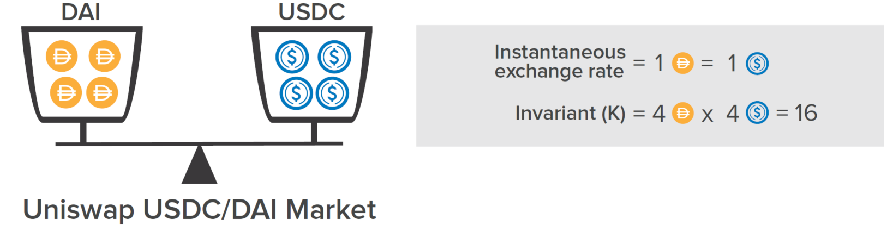

    - To sell 4 DAI for USDC, the investor deposits 4 DAI to the contract and withdraws 2 USDC. Now the USDC balance is 4 – 2 = 2 and the DAI balance is 4 + 4 = 8. Invariant remains at 16.
    
    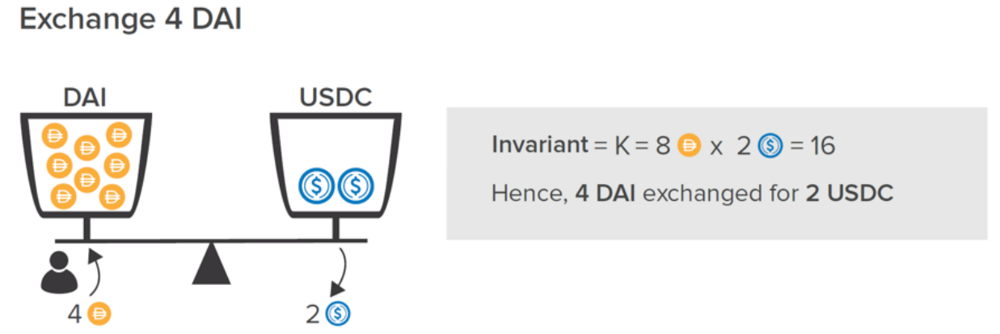

    - Notice that the effective exchange rate was 2 DAI: 1 USDC.
    - The change in the exchange rate is due to slippage because of the low level of liquidity in the market.
    - The magnitude of the invariant determines the amount of slippage.
- Example
    - Assume balance is 100 DAI and 100 USDC; k=10,000
    - If investor sells 4 DAI for USDC, now 3.85 USDC can be withdrawn so much lower slippage at an effective rate of 1.04 DAI: 1 USDC.
  
    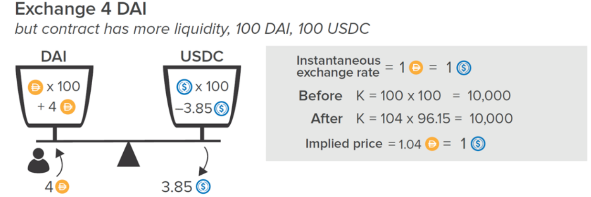

### Importance of liquidity
- Deep liquidity helps minimize slippage.
- Therefore, Uniswap incentivizes depositors to supply capital to a given market.
- Anyone can become a liquidity provider by supplying assets on both sides of a market at the current exchange rate.
- A liquidity provider adds to both sides of the market, thereby increasing total market liquidity. If a user exchanges one asset for another, the total liquidity of the market as measured by the invariant does not change.
- Supplying both sides increases the product of the amount of assets held in the trading pair (i.e., increases the invariant).
- Higher invariants lead to lower slippage and therefore an increase in effective liquidity.
- The invariant as a direct measure of liquidity.
- In summary, ```liquidity providing increases the invariant with no effect on price```, whereas trading against a market impacts the price with no effect on the invariant.
- ```Each trade``` in a Uniswap market has an associated **0.3% fee** that is paid back into the pool.
- Liquidity providers earn these fees based on their pro rata contribution to the liquidity pool.
- They therefore prefer high-volume markets.
- This mechanism of earning fees is ```identical to the cToken model of Compound```. The **ownership stake is represented by a similar token called a Uni token**. For example, the token representing ownership in the DAI/ETH pool is Uni DAI/ETH.

### Impermanent loss
- Liquidity providers in Uniswap essentially earn ```passive income``` in proportion to the volume on the market they are supplying.
- ```Upon withdrawal```, however, the ```exchange rate of the underlying assets will almost certainly have changed```.
- This raises the possibility of ```impermanent loss```.
- **Impermanent loss is the amount of money the liquidity provider would have made if she just held the pair rather than invested in Uniswap pool**.
- The fees earned from trading volume must ```exceed impermanent loss in order for liquidity providing to be profitable```.
- Consequently, ```stablecoin trading pairs``` such as USDC/DAI are attractive for liquidity providers because the **high correlation of the assets minimizes the impermanent loss**.

### Pair correlation
- Uniswap’s ```k = x*y``` pricing model works well if the ```correlation of the underlying assets is unknown```.
- The model calculates the exact same slippage at a given liquidity level for any two trading pairs. In practice, however, we would expect ```much lower slippage for a stablecoin trading pair than for an ETH trading pair```, because we know by design that stablecoin’s price should be close to $1.
- The ```Uniswap pricing model leaves money on the table for arbitrageurs on high correlation pairs``` such as stablecoins, because it does not adjust default slippage lower, as would be expected; the profit is subtracted from the liquidity providers.
- For this reason, ```competitor AMMs```, such as **[Curve](https://curve.fi/)**, that specialize in high-correlation trading pairs may cannibalize liquidity in these types of Uniswap markets.

### Any ERC-20 Pair is possible on Uniswap
- Anyone can start an ```ERC-20/ERC-20``` or ```ETH/ERC-20``` trading pair on Uniswap, if the pair does not already exist, by simply supplying capital on both sides.
- ETH, although fungible, is not an ERC-20 token.
- Many platforms, including Uniswap, instead use ```WETH```, an ```ERC-20- wrapped version of ETH``` to get around this.
- Uniswap allows a user to directly supply and trade with ETH and it converts to WETH behind the scenes.

### Router contracts
- The user determines the initial exchange rate, and arbitrageurs should drive that price to the true market price if it deviates at all.
- Users of the platform can effectively trade any t```wo ERC-20 tokens supported by using router contracts that determine the most efficient path of swaps``` in order to get the ```lowest slippage```, if no direct trading pair is available.


### Front running
- A drawback of the ```AMM model``` is that it is particularly susceptible to **front-running**.
- This should not be confused with illegal front running that sometimes occurs in centralized finance (e.g., a company gets a big buy order and places some of their own trades before the buy order to benefit from the price appreciation from the market impact).
- All information is public in DeFi. So best thought of as “legal” front running.
- When an Ethereum user posts a transaction to the memory pool, it is publicly visible to all Ethereum nodes.
- Front-runners can see this transaction and post a higher gas-fee transaction to trade against the pair before the user’s transaction is
added to a block, and then immediately trade in the reverse direction against the pair.
- This strategy allows a user to easily profit from large transactions, especially in illiquid markets with high slippage.

### Maximum slippage
- Uniswap allows users to set a ```maximum slippage``` as a clause in the transaction. If the ```level of slippage is exceeded```, the trade will **fail to execute**.
- This is a ```smart contract level check```.
- In other words, before finalizing the trade, the contract checks the total slippage from the initially posted price to the effective
execution price (which could have changed if other transactions made it in first like the described front running attempt).
- If this ```slippage exceeds the pre-defined user tolerance```, the entire ```trade is cancelled and the contract execution fails```.
- This provides a limit to the profit front-runners can make, but does not completely remove the problem.

### Arbitrageurs
- Another drawback is that ```arbitrage profits go only to arbitrageurs, who do not have a vested interest in the platform```.
- The arbitrageurs profit at the expense of liquidity providers.
- Competing platforms, such as Mooniswap, propose to solve this issue by supplying virtual prices that slowly approach the true price, leaving tighter time windows and lower spreads for arbitrageurs to capitalize on.
- The additional spread remains in the pool for the liquidity providers.

### Flash Swap
- In a ```flash swap```, the ```contract sends the tokens before the user pays for them with assets on the other side``` of the pair.
- A flash swap unlocks many opportunities for arbitrageurs.
- The user can deploy this instant liquidity to acquire the other asset at a discount on another exchange before repaying it; the corresponding amount of the alternate asset must be repaid in order to ```maintain the invariant```.
- This flexibility in a flash swap is different from the provision in a flash loan, which requires that repayment occur with the same asset.
- A key aspect of a ```flash swap``` is that **all trades must take place during a single Ethereum transaction and that the trade must be closed with the corresponding amount of the complementary asset in that market**.

- Example
    - Consider this example in the DAI/USDC market with a supply of 100,000 each.
    - This implies a 1:1 exchange rate and an invariant of 10 billion.
    - A trader who has no starting capital spots an arbitrage opportunity to buy DAI on a DEX for 0.95 USDC.

    - The trader can capitalize on this arbitrage via a ```flash swap``` by withdrawing 950 USDC of flash liquidity (liquidity derived from a flash loan) from the DAI/USDC market, purchase 1,000 DAI via the described arbitrage trade, and repay 963 DAI for a profit of 37 DAI— all consummated with no initial capital.
    - The figure of 963 is calculated as 960 (with rounding for ease of illustration) to maintain the 10 billion invariant, and to account for some slippage, plus a 0.30%*960 = 3 DAI transaction fee.
    - The 30bp fee is paid into the pool owned by the liquidity providers.
   
    


### Uniswap Governance
- Lastly, an important point about Uniswap is the release of a **governance token in September 2020 called UNI**.
- Like COMP, the Compound governance token, UNI is distributed to users to incentivize liquidity in key pools including ```ETH/USDC``` and ```ETH/DAI```.
- The UNI governance even has s```ome control over its own token distribution because 43% of the supply will be vested over four years to a treasury controlled by the UNI governance```.
- Importantly, each unique Ethereum address that had used Uniswap before a certain cutoff date (over 250,000 addresses) was given 400
UNI tokens as a free airdrop.
- At the same time as the airdrop, ```UNI``` was released on Uniswap and the Coinbase Pro exchange for trading.

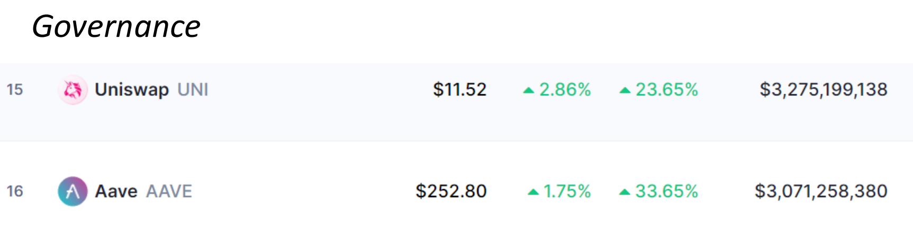

### Main innovation Uniswap v3
- On May 5, 2021, Uniswap v3 is launched
- Liquidity providers can allocate funds to a custom range (the range in the CFMM is not limited and potentially infinite).
- This creates individualized price curves and traders interact with the aggregation of the liquidity of all of these curves.
- Given the ability to specify a range, ```v3 is somewhat analogous to a limit order system```.

### Uniswap Summary
- Uniswap is critical infrastructure for DeFi applications; it is important to have exchange operational whenever it is needed.
- Uniswap offers a unique approach for generating yield on users’ assets by being a liquidity provider.
- The platform’s flash swap functionality aids arbitrageurs in maintaining efficient markets and unlocks new use cases for users. Users can access any ERC-20 token listed, including creating completely new tokens through an IDO.

Traditional Finance Problem | Uniswap Solution |
---|---|
Centralized Control: Exchanges that control which trading pairs are supported| Allows anyone to create a new trading pair if it does not already exist and automatically routes trades through the most efficient path if no direct pair exists.|
Limited Access: The best investment opportunities and returns from liquidity providing are restricted to large institutions.| Anyone can become a liquidity provider and earn fees for doing so. Any project can list its token on Uniswap to give anyone access to an investor.|
Inefficiency: Trades generally require two parties to clear. | An AMM that allows constant access for trading against the contract. | 
Lack of Interoperability:Ability to exchange assets on one exchange is not easily used within another financial application.| Any token swap needed for a DeFi application can utilize Uniswap as an embedded feature.|
Opacity: Unknown if the exchange truly owns all user’s entire balance. | Transparent liquidity levels in the platform and algorithmic pricing.|


## Balancer

### Overview
- Balancer is a **decentralized exchange** with an **Automated Market Maker** and is ```similar to Uniswap```.
- ```Up to 8 assets``` (ERC-20 Tokens or ETH) can be supported in ```a single liquidity pool```.
- Assets can be weighed arbitrarily and do not need to be weighted 50:50 in value like in Uniswap.
- ```Liquidity pool controller``` (creator) sets **transaction fees**.
- **Liquidity pools can be finalized (public), controlled (private), or smart (controlled by a smart contract**.


### Bonding Surfaces
- To allow ```up to 8 assets``` in a single Liquidity pool, Balancer uses ```bonding surfaces```, which ```generalizes Uniswap’s x*y=k formula``` to **n dimensions**

- The Bonding Surface is given by [bonding_surface_formula.](Figs/bonding_surface_formula.png)
    - V is the value function (analogous to k in a bonding curve)
    - n is the number of tokens in the pool
    - B is the balance of token t in the pool
    - W is the normalized weight of token t

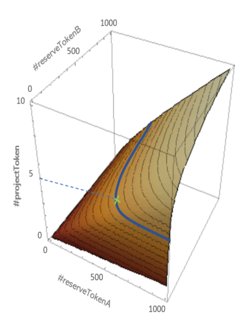

### Token Price and Pool Value
- The effective price between a single pair of tokens is given by the ratio of the token balances normalized by their weights: [ratio](Figs/ratio.png))
    - Where A_x is the amount of token x being bought and A_y is the amount of token y being sold


### Swap Fees and Limits
- A user can only **swap in up to 50% of the current balance of a token into a pool**.
- A user can **swap out up to 33.3% of the current balance of a token out of a pool**.
- Liquidity pool controllers set ```transaction fees between 0.0001% and 10%```.


### Impermanent Loss
- Impermanent loss can be higher or lower in Balancer depending on the weighting of tokens
- Two tokens weighted 50/50 and a 5x increase in the token valuation results in an impermanent loss of 25.5%. However, two tokens weighted 95/5 and the same increase results in an impermanent loss of just 3.88%.
- If a pool creator is confident in a token, they can create more uneven pools to offer themselves selective exposure and earn transaction fees.

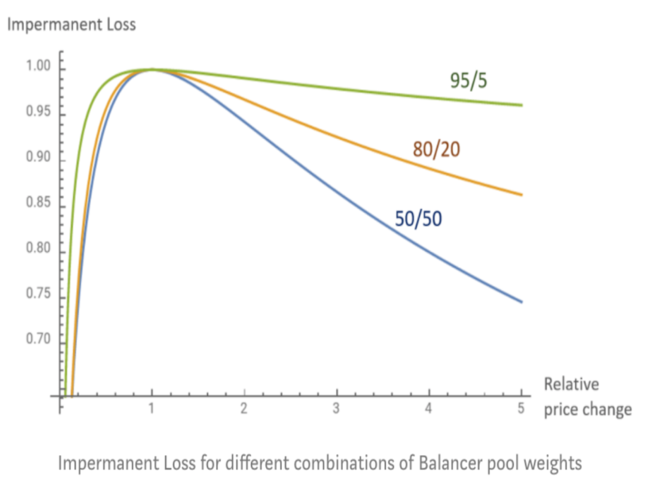

### Slippage and Smart Order Router
- Equal token weights in a pool have the lowest slippage, while uneven pools have higher slippage, which disincentivizes traders from using the pool and results in less trading volume and lower transaction fees generated for the pool
- ```Smart Order Router (SOR)``` is an ```off-chain price optimizer that searches across all Balancer pools to find the best price```.

### Balancer Governance
- **BAL** is the ```Balancer Governance Protocol Token```.
- Total supply of BAL is capped at 100M BAL
- 25M to founders, advisors, and investors
- 5M to Balancer Ecosystem Fund and 5M to fundraising fund
- 65M to liquidity providers with 145,000 BAL per week distributed to providers
- The community will have to decide if token distribution should end before the cap is reached.
- BAL is distributed to liquidity miners as a function of the total amount of liquidity contributed relative to the total liquidity on Balancer


## Rehypothecation

### What is rehypothecation?
- In traditional finance, hypothecation is simply pledging collateral for debt.
- **Rehypothecation is a practice whereby banks or brokerages use assets posted by their clients for their own trading** (e.g., bank using the client collateral as their collateral to take out a loan – which is a derivative asset)
- It is sometimes called “re-pledging” or “re-use”.
- In traditional finance, the amount of rehypothecation is regulated (see, for US, Fed Regulation T and SEC Rule 15c3-3)

### Total Locked Value (TLV)
- **TLV** is a ```measure of the usage of DeFi protocols```.
- When you add liquidity (for example into MakerDAO, Compound, Aave, or Uniswap), this value is referred to as the “locked” value.
- “Locked” is misleading because you can easily repatriate in DeFi
- We might assume that the collateral assets that are pledged are locked in the context of the particular application
- However, this is not necessarily the case because the equity tokens (representing the share of the LP) are a type of derivative asset that rehypothecates the collateral.

### Money multiplier
- A similar situation exists in CeFi
- You deposit $100 at a bank. The bank must set aside 10% at the Federal Reserve and then lends out $90.
- A borrower gets the $90 and deposits at another bank. The second bank sends $9 as the required reserve to the Fed an loans out $81.
- This process continues and induces a money multiplier. The original $100 deposit generates much more than $100 in loans.
- The multiplier is 1/(reserve ratio)

### DeFi multiplier example
- User deposits $1500 of WETH into Maker and gets a loan of 1,000 DAI (this implies a 150% collateralization ratio)
- User deposits the borrowed 1,000 DAI along with 1,000 USDC into a Uniswap v2 DAI-USDC pool. The user’s total investment is $2,500 (WETH + USDC).
- Uniswap issues DAI-USDC LP tokens that represent $2,000.
- User could redeposit the LP tokens into Maker to get another loan of 1,960 DAI (collateralization ratio = 102%)
- Let’s calculate the TLV
    - WETH = $1,500 backing Maker loan
    - Liquidity added to Uniswap v2 (USDC) = $1,000
    - Liquidity added to Uniswap v2 (DAI) = $1,000
    - Uniswap DAI-USDC LP tokens backing new loan at Maker = $2,000 Total = $5,500 – yet only $2,500 pledged. Note we could get an even higher number if we repeat the process with the new 1,960 DAI loan!
    - Multiplier formula more complicated because of different “reserve” ratios


## Yield Protocol

### What is Yield protocol?
- Yield Protocol proposes a **derivative model for secured, zero-coupon bonds**. This enables **fixed rate borrowing**.
- Essentially, the protocol defines a ```yToken``` to be an ERC-20 (fungible) token that settles in some fixed quantity of a target asset at a specified date.
- The contract will specify that the ```tokens, which have the same expiry, target asset, collateral asset, and collateralization ratio, are fungible```.


### Yield Motivation
- Suppose you believe that ETH will appreciate by 10% over the next year.
- You could deposit ETH in Maker, borrow DAI at 3%, and reinvest in ETH.
- If ETH goes up by 10%, you would make 7%
- However, what happens if the variable borrow rate in Maker goes up to 10%? Your profit would be wiped out? This motivates a fixed rate borrow protocol

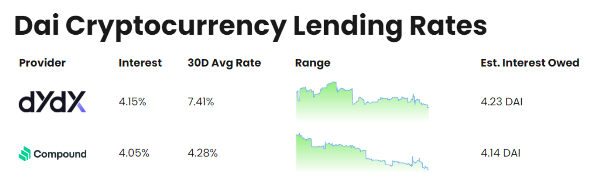

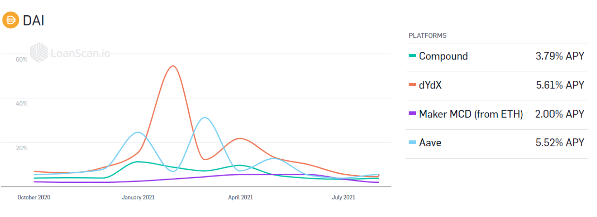


### What is Yield protocol?
- The tokens are secured by the collateral asset and have a required ```maintenance collateralization ratio similar to, for example, MakerDAO```, as well as to other DeFi platforms we have discussed.
- If the collateral’s value dips below the maintenance requirement, the position can be liquidated by a ```keeper``` with some or all of the collateral sold to cover the debt.

- Example
    - The yToken effectively allows for fixed-rate borrowing and lending, using the implied return on the discounted price of the token versus the target amount.

    - We can illustrate as follows: assume a user has a yToken with the target asset of 1 DAI backed by ETH. The maturity date is one year ahead and the yToken is trading at 0.92 DAI. A purchase of the yToken effectively secures an 8.7% fixed interest rate, even in the case of a liquidation [(0.08/0.92) -1].
    - In the event of a normal liquidation, the collateral would be sold to cover the position, as shown in the Exhibit.
    - The buyer of yDAI locks in a 8.7% return
    - The borrower locks in a fixed rate loan at 8.7%.
    - The borrower can use the 92 DAI to buy additional ETH.
    
    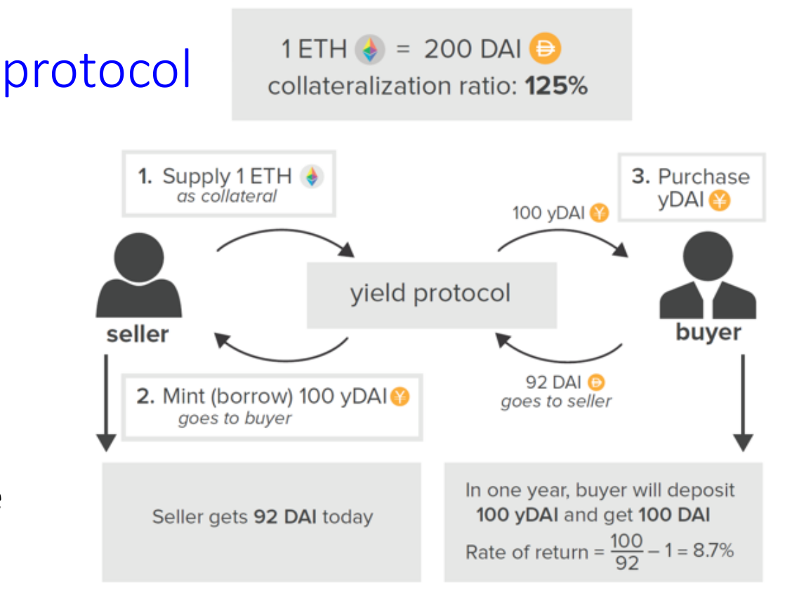

    - Keeper triggers liquidation if ETH price falls below maintenance point
    - Buyer gets full 8.7% return – even if liquidation happens after one month
    - Borrower gets 0.2 ETH back ($25) + 92 DAI (borrowed earlier) so the cost is 8.7% there is also keeper reward
    
    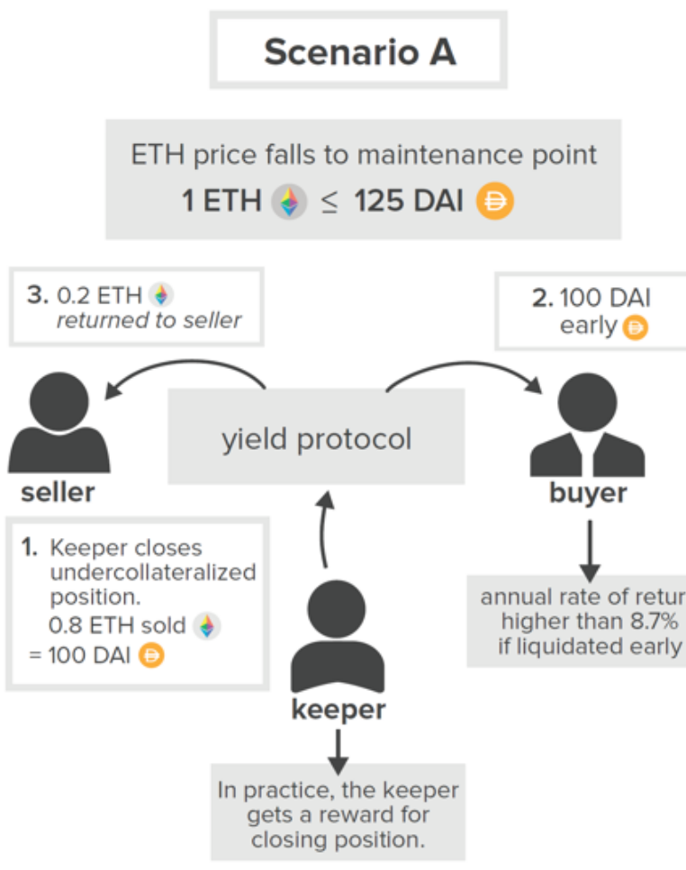

    - Suppose ETH holds value at 200 DAI (no liquidation)
    - 0.5 ETH used to buy 100 DAI which is transferred to buyer (who makes 8.7%)
    - Seller/borrower gets the original 92 DAI plus the excess collateral (0.5 ETH worth $100)
    
    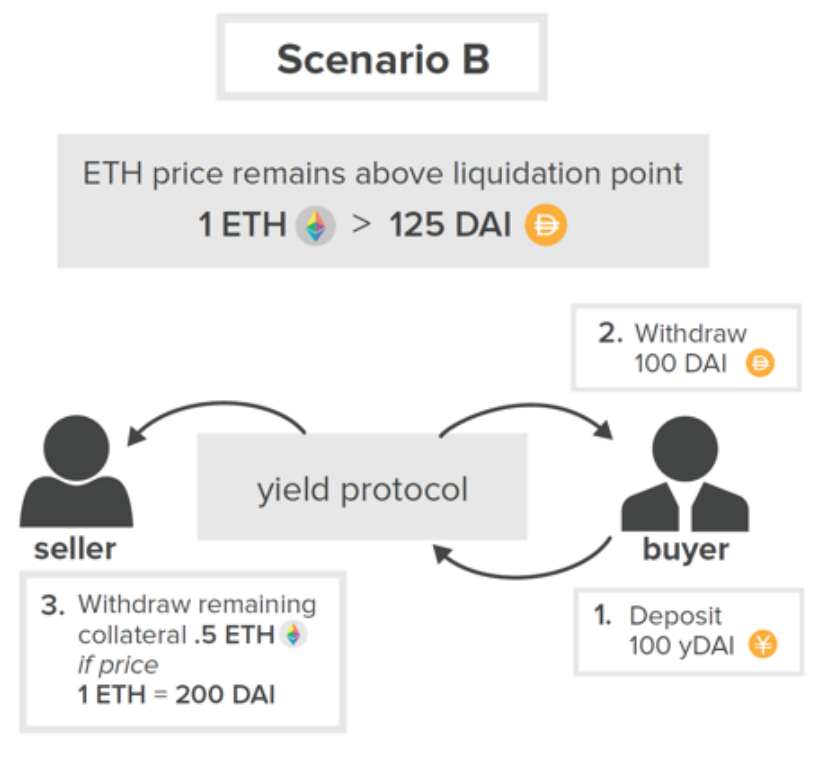

    - The seller/borrower does well if the value of ETH increases
    - If the seller/borrower uses the 92 DAI to buy more ETH, the price of ETH needs to increase by at least 8.7% divided by the collateralization ratio


### Yield Curves
- The ```yTokens``` also allow for the construction of yield curves by analyzing the implied yields of short and longer term contracts.
- This can allow observers to get insights into investor sentiment among the various supported target assets.

### Betting on Rates
- The Yield Protocol can be used to speculate on interest rates.
- There exist a few DAI derivative assets that represent a ```variable interest rate``` (```Compound cDAI, Aave aDAI, Chai```).
- One can imagine a seller of yDAI using one of these DAI derivative assets as collateral. The effect of this transaction is that the seller is paying the fixed rate on the yDAI while receiving the variable rate on the collateral. This is a bet that rates will increase.
- Likewise purchasing yDAI (of any collateral type) is a bet that variable rates will NOT increase beyond the fixed rate received.


### Yield Summary
- Yield is an important protocol that supplies fixed rate products to Ethereum.
- It can be tightly integrated with other protocols like MakerDAO and Compound to create robust interest-bearing applications for investors.
- Demand for fixed income components will grow as mainstream investors begin adopting DeFi with portfolios in need of these types of assets.


Traditional Finance Problem | Yield Solution |
---|---|
Centralized Control: Fixed income instruments largely restricted to governments and large corporations.| Yield protocol is open to parties of any size.|
Limited Access: Many investors have limited access to buy or sell sophisticated fixed income investments.| Yield allows any market participant to buy or sell a fixed income asset that settles in a target asset of their choosing.|
Inefficiency: Fixed income rates are lower due to layers of fat in traditional finance. | Lean infrastructure running on Ethereum allows for more competitive rates and diverse liquidity pools. | 
Lack of Interoperability: Fixed income instruments generally settle in cash which the investor must determine how to allocate.| yTokens can settle in any Ethereum target asset and even settle synthetically into a floating-rate lending protocol to preserve returns.|
Opacity: Risk and uncertainty of counterparty in traditional agreements. | Clear collateralization publicly known on Ethereum blockchain backing the investment.|


## dYdX

### What is dYdX?
- [dYdX](https://dydx.exchange/) is a company that specializes in ```margin trading and derivatives```.
- The margin trading protocol supports ```USDC, DAI, and ETH```.
- The company has a spot **DEX** that allows investors to exchange these assets against the current bid–ask on the order book.

### Order Processing
- The DEX uses a **hybrid on–off chain** approach.
- Essentially ```dYdX stores signed or pre-approved orders without submitting to Ethereum```.
- These orders use cryptography to guarantee they are only used to exchange funds for the desired asset at the desired price.
- The DEX supports limit orders and a maximum slippage parameter for market orders in an effort to mitigate the slippage associated with price moves or front running.

### Order Processing
- Allowing dYdX to match the orders holds little or no risk that the company could steal user funds, because the signed orders can only
be used as intended per the smart contract.
- When the orders are matched, they are submitted to the Ethereum blockchain, where the smart contract facilitates settlement.

### Leverage
- **Levered long or short position** are possible using margined collateral.
- The **maximum leverage** ```dYdX``` currently allows is **10** times. We will see the leverage is higher for perpetual futures.
- The positions can be isolated so that a single collateral deposit is used or cross-margined so that all of the investor’s balances are pooled to serve as collateral.

### Keepers
- As in other protocols, dYdX has a maintenance margin requirement that if not maintained triggers liquidation of the collateral to close
the position.
- The liquidations can be performed by external keepers who are paid to find and liquidate underwater positions, similar to the process followed by MakerDAO.

### Lending/borrowing
- dYdX ```offers borrowing and lending``` similar to ``Compound`` and ```Aave```.
- The dYdX markets also feature ```flash loans```.
- Unlike Aave, the ```flash loans are free```, so that dYdX is a popular choice for DAI, ETH, and USDC flash liquidity.


### Free flash loans
- In the world of open smart contracts, it makes sense that flash loans rates would be driven to zero given that they are near risk free.
- Lending rates are determined by the loan’s duration and default risk.
- For flash loans, repayment is algorithmically enforced and time is infinitesimal: in a single transaction, only the user can make any
function calls or transfers.
- No other Ethereum users can move funds or make any changes while a particular user’s transaction is in flight, resulting in no opportunity cost for the capital.


### Flash loans and arbitrage
- A market participant offering free flash loans will attract more usage to their platform.
- Because flash loans do not require any upfront capital, they democratize access to funds for various use cases.
- In the Aave example, we showed how flash loans can be used to refinance a loan.
- We will now illustrate the use of flash loans to capitalize on an arbitrage opportunity.

- Example
    - Suppose the effective exchange rate for 1,000 DAI for ETH on Uniswap is 6 ETH/1,000 DAI. (The instantaneous exchange rate would be different, due to slippage.)
    - Also, suppose the dYdX DEX has a spot ask price of 5 ETH for 1,000 DAI (i.e., the ETH are much more expensive on dYdX than Uniswap).
    - Arbitrage opportunity, (without any capital beyond the gas fee):
      1. Execute a flash loan to borrow 1,000 DAI,
      2. Exchange it on Uniswap for 6 ETH, and
      3. Use 5 of those ETH to trade for 1,000 DAI on dYdX.
      4. Repay the flash loan with the 1,000 DAI and
      5. Pocket the 1 ETH profit.
    - All of this happens in a single transaction.
    
    


- NOTE: August 3, 2021 dYdX launches its governance token: ```DYDX```

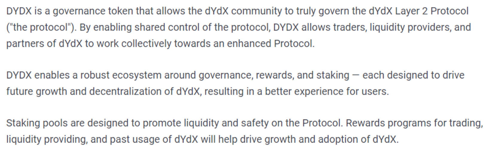


### dYdX Perpetual futures
- **Perpetual futures are a popular derivative product** similar to traditional futures but without a settlement date.
- By entering into a perpetual futures contract, the ```investor is simply betting on the future price of an asset```.
- The contract can be ```long or short```, ```with or without leverage```.
- Perpetual futures are equivalent to a swap consisting of a portfolio of one-day forwards/futures
- Traditional markets have fixed expiration. Having a single contract reduces the chance that certain expiration dates have little liquidity
- The perpetual futures contract uses an Index Price based on the average price of the underlying asset across the major exchanges.
- ```BTC-USD Perpetual``` uses the ```MakerDAO BTCUSD Oracle V2```, an oracle that reports in on-chain fashion the bitcoin prices from the cryptocurrency exchanges of Binance, Bitfinex, Bitstamp, Bittrex, Coinbase Pro, Gemini, and Kraken.
- The investor deposits margin collateral and chooses a direction and amount of leverage.
- Leverage up to 25x is possible
- The contract can trade at a premium or discount to the Index Price depending on whether more traders are long or short the underlying, in this case BTC.

### Futures funding rate
- A funding rate, paid from one side to the other, keeps the futures price close to the Index.
- If the futures contract is trading at a premium to the Index, the funding rate would be positive, and longs would pay shorts.
- The magnitude of the funding rate is a function of the difference in price compared to the Index.
- Likewise, if the contract is trading at a discount, the shorts pay the long positions.
- The funding rate incentivizes investors to take up the opposing side from the majority in order to keep the contract price close to the Index.
- Each protocol in DeFi can only update balances when a user interacts with the protocol.
- For example, in Compound, the interest rate is fixed until supply enters or leaves the pool which changes the utilization.
- The contract simply keeps track of the current rate and the last timestamp when the balances updated.


### dYdX Layer 2
- On April 20, 2021, dYdX moved the perpetual futures to Layer 2 technology (which we discuss on the fourth course –it is a way to trade off-chain in a secure manner with multi-signature vaults)
- This means trading with no gas fees
- Up to 25x leverage is allowed

### dYdX Margins
- Like a traditional futures contract, the perpetual futures contract has two margins: **initial and maintenance**.
- Suppose the initial margin is 10%. This means the investor needs to post collateral (or equity) worth 10% of the underlying asset.


### Traditional long futures
- A long futures contract allows the investor to buy the asset at a set price in the future.
- If the market price rises, the investor can buy the asset at a price cheaper than the market price and the profit is the difference between the market price and the contract price.


### Traditional short futures
- A short position works similarly except that the investor agrees to sell the asset at a fixed price.
- If the market price falls, the investor can purchase the asset in the open market and sell at the higher price stipulated in the contract.
- The profit is the difference between the contract price and the market price.

### Futures risk
- The risk is that the price moves against the investor.
- For example, if the investor is long with a 10% margin and the market price drops by 10%, the collateral is gone because the difference between purchasing at the contract price and selling in the open market (at a loss) wipes out the value of the collateral.


### Futures are not options
- If the underlying asset’s price moves the wrong way in an option contract, the ```option holder can walk away```: The exercise of the option is discretionary—that’s why it is called an “option”—and no trader would exercise an option to guarantee a loss.
- ```Futures```, however, are **obligations**.
- As such, traditional exchanges have mechanisms that seek to minimize the chance the contract holder does not default on a losing position.


### Traditional maintenance margin
- The maintenance margin is the main tool to minimize default.
- Suppose the maintenance margin is 5%.
- On a traditional futures exchange, if the price drops by 5% the investor is required to replenish the collateral to bring it back up to
10%.
- If the investor fails to do this, the exchange liquidates the position.


### Maintenance margin
- A similar mechanism exists on dYdX, but with important differences.
- 1. If any position falls to 5%, keepers will trigger liquidation. If any collateral remains, they may keep it as a reward.
- 2. The liquidation is almost instantaneous.
- 3. No centralized exchange exists.
- 4. dYdX contracts are perpetual, whereas traditional exchange contracts usually have a fixed maturity date.


### dYdX Mechanics
- Suppose the BTC price index is 10,000 USDC/BTC.
- An investor initiates a long position by depositing 1,000 USDC as margin (collateral), creating a levered bet on the price of BTC.
- If the price rises by 5%, the profit is 500.
- Given the investor has only deposited 1,000, the investor’s rate of return is 50%, or (1,000 − 500)/1,000.
- We can also think about the mechanics another way.
- Taking a long position at 10,000, the investor is committing to buying at 10,000 and the obligation is 10,000.
- Think of the obligation as a “negative balance” because the investor must pay 10,000 according to the contract.
- The investor has already committed collateral of 1,000 and owes 9,000. This is sometimes called the “short” or “owed” balance.
- On the other side of the ledger, the investor has committed those funds to buy an asset, 1 BTC. This is known as the “long” balance.
- The investor thus has a positive balance of 10,000, the current price.
- The collateralization ratio is 10,000/9,000 = 111%, which is a margin percentage of 11% and is nearly the maximum amount of allowed leverage (10% margin).
#### Long position

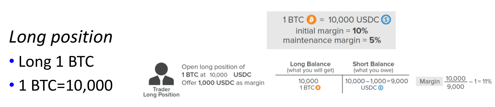

- Long 1 BTC
- Price increases by 10%

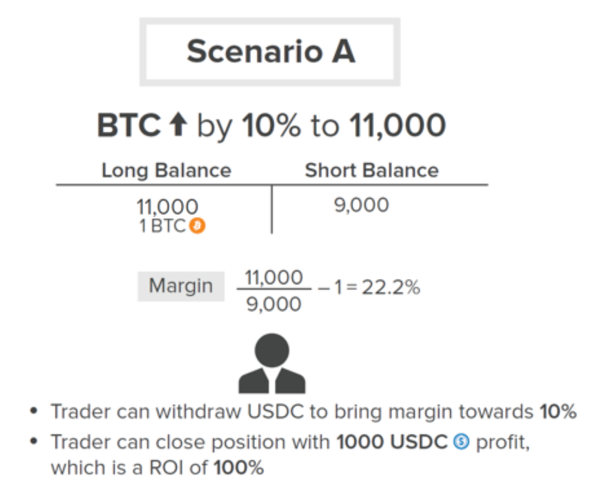

- Long 1 BTC
- Price decreases by -7.5%

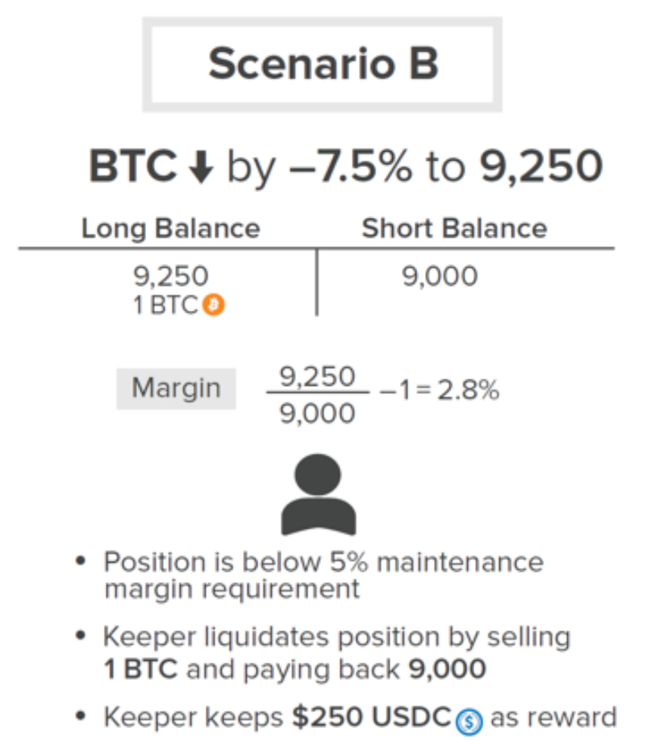

#### Short position
- This intuition works similarly for a short position.
- The investor has committed to sell at 10,000, which is a positive balance and is supplemented by the margin deposit of 1,000 (so
total of 11,000).
- The investor’s negative balance is the obligation to buy 1 BTC, currently worth 10,000.
- The collateralization ratio is 11,000/10,000, which corresponds to a margin of 10%.

#### Short position when underlying price rises
- Suppose the underlying asset (BTC) increases in value by 5%.
- If the price of BTC increases to 10,500 (a 5% increase), the margin percentage becomes (11,000/10,500) − 1 = 4.76% and the short position becomes subject to liquidation.
- The paper net balance of the position is $500, the incentive for the liquidator to close the position collect the balance.

### Beyond perpetual futures
- Perpetual options have also been proposed (but not they are not available at this time on dYdX)
- The concept of futures-style futures options has been studied before. See Asay (1982) and Whaley (2006, p. 239)
- Since the everlasting option may be written as a portfolio of regular options, we can compute the delta of the position (sensitivity to changes in the underlying asset) and hedge it using the underlying or the perpetual futures


### dYdX Summary
- The dYdX BTC perpetual futures contract allows investors to access BTC returns natively on the Ethereum blockchain, while being able
to supply any ERC-20 asset as collateral.
- Perpetual futures are rising in popularity, and this functionality may continue to attract liquidity over time.


Traditional Finance Problem | dYdX Solution |
---|---|
Centralized Control: Borrowing and lending rates controlled by institutions.| dYdX rates are determined algorithmically.|
Limited Access: Difficulty in accessing high yield USD investment opportunities or competitive borrowing as well as futures and derivative products. Access to capital for immediately profitable enterprises is limited.| Open ability to borrow or lend any supported assets at competitive algorithmically determined rates. Includes a perpetual futures contract that could synthetically support any asset. Free flash loans give anyone access to large amounts of capital to capitalize on arbitrage or other profitable opportunities.|
Inefficiency: Suboptimal rates for borrowing and lending due to inflated costs. | Algorithmically pooled and optimized interest rates. Free flash loans offered for immediate use cases. | 
Lack of Interoperability: Difficult to repurpose funds within a financial instrument.| Flash loans can immediately utilize the entirety of the AUM for outside opportunities without risk or loss to investors.|
Opacity: Unclear collateralization of lending institutions. | Transparent collateralization ratios of borrowers are visible to the entire ecosystem.|


## Synthetix


### What is Synthetix?
- Many traditional derivative products have a decentralized counterpart.
- DeFi, however, allows new types of derivatives because of smart contracts.
- Imagine creating a derivative cryptoasset, whose value is based on an underlying asset that is neither owned nor escrowed.
- Synthetix is one company whose primary focus is creating a wide variety of liquid synthetic derivatives.
- The company issues Synths, tokens whose prices are pegged to an underlying price feed and are backed by collateral.
- MakerDAO’s DAI is also a synthetic asset.
- The price feeds come from the Chainlink’s decentralized oracles.
- Synths can theoretically track any asset, long or short.
- In practice, the main tracked assets are cryptocurrencies, fiat currencies, and gold.


### Synthetix tokens
- A long Synth is called an sToken, for example, a sUSD or a sBTC.
- The sUSD is a synthetic because its value is based on a price feed.
- A short Synth is called an iToken, for example, an iETH.


### Synthetix platform token
- Synthetix also has a platform token called SNX. SNX is not a governance token like MKR and COMP, but is a utility token or a network token, which means it enables the use of Synthetix functionality as its only feature.
- SNX serves as the unique collateral asset for the entire system.


### Minting synths
- When users mint Synths against their SNX, they incur a debt proportioned to the total outstanding debt denominated in USD.
- They become responsible for this percentage of the debt in the sense that to unlock their SNX collateral they need to return the
total USD value of their debt.
- The global debt of all Synths is thus shared collectively by the Synth holders based on the USD-denominated percentage of the debt they owned when they opened their positions.
- The total outstanding USD-denominated debt changes when any Synth’s price fluctuates, and each holder remains responsible for the same percentage they were responsible for when they minted their Synths.
- Therefore, when a SNX holder's Synths outperform the collective pool, the holder effectively profits, and vice versa, because their
asset value (their Synth position) outpaced the growth of the debt (sum of all sUSD debt).
- In any Synthetix position, the trader is effectively “long” his personal portfolio against the entire pool's portfolio.
- In other words, the trader is betting his returns will exceed the pool’s returns.
- For example, by holding sUSD only, the trader is effectively shorting the entire composition of all other traders’ Synthetix portfolios and betting that USD will outperform all other assets held.
- The trader’s goal is to own Synths that he thinks will outperform the rest of the market, because it is the only way to profit.

- Example
    - As an example, three traders each have $20,000 for a total debt of $60,000: one holds 2 sBTC priced at $10,000 each, one holds 100
    sETH priced at $200 each, and one holds 20,000 sUSD priced at $1 each. Each has a debt proportion of 33.3%.

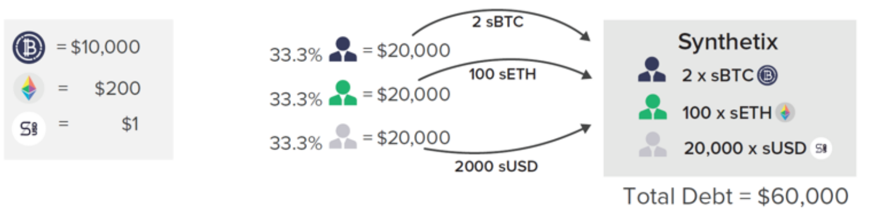

- If the price of BTC doubles to $20,000 and the price of ETH goes up 5x to $1,000, the total debt becomes $160,000 = $40,000 (sBTC) +
$100,000 (sETH) + $20,000 (sUSD).
- Because each trader is responsible for 33.3%, about $53,300, only the sETH holder is profitable even though the price of BTC doubled.

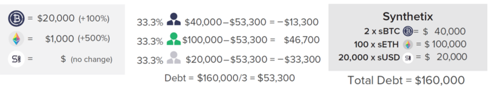

- If the price of BTC falls to $5,000 and ETH to $100, then the total debt falls to $40,000 and the sUSD holder becomes the only profiting trader.

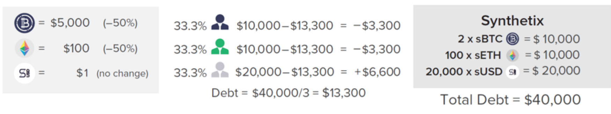


### Plaform DEX
- The platform has a DEX native that will exchange any two Synths at the rate quoted by the oracle.
- SNX holders pay the exchange fees to a fee pool redeemable by SNX holders in proportion to their percentage of the debt.
- The contracts enforce that users can only redeem their fees if they maintain a sufficient collateralization ratio relative to their portion of the debt.

### Collateralization
- The required collateralization ratio to mint Synths and participate in staking rewards is high, currently 800%.
- The Synthetix protocol also mints new SNX tokens via inflation to reward various stakeholders in the ecosystem for contributing value.
- The protocol distributes the rewards as a bonus incentive for maintaining a high collateralization ratio or increasing the liquidity of SNX.
- Synthetix has branched into products that track real-world equities with the release of sNIKKEI and sFTSE.
- The company is also beginning to offer an options trading interface, further expanding its capabilities.
- The platform could easily gain popularity because there is no slippage against the price feed, however, the pooled liquidity and shared debt models offer interesting challenges.

Traditional Finance Problem | Synthetix Solution |
---|---|
Centralized Control: Assets can generally only be bought and sold on registered exchanges.| Offer synthetic assets in one place that can track any real world asset.|
Limited Access: Access to certain assets is geographically limited.| Anyone can access Synthetix to buy and sell Synths.|
Inefficiency: Large asset purchases suffer from slippage as traders eat into the liquidity pool. | Synths exchange rates are backed by a price feed, which eliminates slippage. | 
Lack of Interoperability: Real-world assets such as stocks can’t be easily represented directly on a blockchain| Synth representations of real assets are totally compatible with Ethereum and other DeFi protocols.|


## Tokenization - Set Protocol

### What is tokenization?
- Tokenization refers to the process of taking some asset or bundle of assets, either on or off chain, and
  - 1. representing that asset on chain with possible fractional ownership, or
  - 2. creating a composite token that holds some number of underlying tokens.
- A token can conform to different specifications based on the type of properties a user wants the token to have.
- The most popular token standard is ERC-20, the fungible token.
- ERC-20 defines abstractly how a token, which has units that are non- unique and interchangeable (such as USD), should behave.
- ERC-721 standard defines nonfungible tokens (NFTs). These tokens are unique, such as a token representing ownership of a piece of fine art or a specific digital asset from a game.
- DeFi applications can take advantage of these and other standards to support any token using the standard simply by coding for the single standard.
### What is Set Protocol?
- Set Protocol offers the “composite token” approach to tokenization.
- Set Protocol combines Ethereum tokens into composite tokens that function more like traditional exchange traded funds (ETFs).
- Set Protocol combines cryptoassets into Sets, which are themselves ERC-20 tokens and fully collateralized by the components escrowed
in a smart contract.

### Static Sets
- A Set token is always redeemable for its components.
- Sets can be static or dynamic, based on a trading strategy.
- Static Sets are straightforward to understand and are simply bundled tokens the investor cares about; the resulting Set can be transferred as a single unit.
- DeFi Pulse creates a portfolio of DeFi tokens - [check this](https://www.tokensets.com/portfolio/dpi)


### Dynamic Sets
- Dynamic Sets define a trading strategy that determines when reallocations can be made and at what times.
- Some examples include the “Moving Average” Sets that shift between 100% ETH and 100% USDC whenever ETH crosses its X-day simple or exponentially weighted moving average.
- Similar to normal ETFs, these Set tokens have fees and sometimes performance-related incentives.
- At the Set’s creation, the manager pre-programs the fees, which are paid directly to the manager for that particular Set.
- The available fee options are:
  - 1. buy fee (front-end load fee),
  - 2. streaming fee (management fee), and
  - 3. performance fee (percentage of profits over a high-water mark).
- The Set Protocol currently takes no fee for itself, although it may add a fee in the future.
- At the Set’s creation
- Ember Fund’s **“The Quant”** leverages machine learning and regression analysis to generate signals to automatically rebalance between Bitcoin and a Stablecoin. This portfolio is constructed in partnership with [Blockforce Capital](https://blockforcecapital.com/), a leading multi-strategy cryptocurrency hedge fund for institutional investors.

### Oracle
- The prices and returns for Set Protocol are calculated via MakerDAOs’ publicly available oracle price feeds, which are also used by Synthetix.
- The main value-add of dynamic Sets is that the trading strategies are publicly encoded in a smart contract so users know exactly how their funds are being allocated and can easily redeem at any time.


### Social trading
- Set Protocol also has a Social Trading feature in which a user can purchase a Set whose portfolio is restricted to certain assets with
reallocations controlled by a single trader.
- Because these portfolios are actively managed, they function much more like mutual or hedge funds.
- The benefits are similar in that the portfolio manager has a predefined set of assets to choose from, and the users benefit from this contract-enforced transparency.

- Example
    - A portfolio manager for a Set has a goal to “buy low and sell high” on ETH.
    - The only assets she can use are ETH and USDC, and the only allocations she is allowed are 100% ETH and 100% USDC.
    - At her sole discretion, she can trigger a contract function to rebalance the portfolio entirely into one asset or the other; this is the only allocation decision she can make.

    - Assume she starts with 1,000 USDC. The price of ETH dips to 100 USDC/ETH and she decides to buy.
    - She can trigger a rebalance to have 10 ETH in the Set.
    - If the price of ETH doubles to $200, the entire Set is now worth $2,000.
    - A shareholder who owns 10% of the Set can redeem her shares for 1 ETH or 200 USDC.


### Summary  Set Protocol
- Sets could democratize wealth management in the future by being more peer to peer, allowing fund managers to gain investment exposures through nontraditional channels and giving all investors access to the best managers.
- Many use cTokens, (Compound) earning interest through the Compound protocol.
- This is one example of DeFi platforms being composed (DeFi Legos) to create new products and value for investors.


Traditional Finance Problem | dYdX Solution |
---|---|
Centralized Control: Fund managers can control their funds against the will of investors.| Enforces sovereignty of the investor over their funds at the smart contract level.|
Limited Access: Talented fund managers often are unable to gain exposures and capital to run a successful fund.| Allows anyone to become a fund manager and display their skills using social trading features.|
Inefficiency: Many arising from antiquated practices. | Trading strategies encoded in smart contracts lead to optimal execution. | 
Lack of Interoperability: Difficult to combine assets into new packages and incorporate the combined assets into new financial products.| Set tokens are ERC-20 compliant tokens that can be used on their own in other DeFi protocols. For example, Aave allows Set token borrowing and lending for some popular Sets.|
Opacity: Difficult to know the breakdown of assets in an ETF or mutual fund at any given time. | Total transparency into strategies and allocations of Set tokens.|

## WBTC

### What is WBTC?
- The WBTC application takes the representing off-chain assets on chain approach to tokenization, specifically for BTC.
- Wrapped bitcoin or wBTC allows BTC to be included as collateral or liquidity on all of the Ethereum-native DeFi platforms.
- Given that BTC has comparatively low volatility to other crytpocurrencies and is the most well-adopted cryptocurrency by market-cap, this characteristic unlocks a large potential capital pool for DeFi dApps.
- See [white paper](https://wbtc.network/assets/wrapped-tokens-whitepaper.pdf)

### Stakeholders
- The WBTC ecosystem contains three key stakeholders: users, merchants, and custodians.
- Users are simply the traders and DeFi participants who generate demand for the value proposition associated with wBTC, namely, Ethereum-tokenized BTC.
- Users can purchase WBTC from merchants by transferring BTC and performing the requisite KYC/AML, thus making the entry and exit points of wBTC centralized and reliant on off-chain trust and infrastructure.
- Merchants are responsible for transferring WBTC to the custodians.
- At the point of transfer, the merchant signals to an on-chain Ethereum smart contract that the custodian has taken custody of the BTC and is approved to mint WBTC.
- Custodians use industry-standard security mechanisms to custody the BTC until it is withdrawn from the WBTC ecosystem.
- Once the custodians have confirmed receipt, they can trigger the minting of WBTC that releases WBTC to the merchant.
- Finally, closing the loop, the merchant transfers the WBTC to the user.
- No single participant can control the minting and burning of WBTC, and all BTC entering the system is audited via transaction receipts
that verify custody of on-chain funds.
- These safeguards increase the system’s transparency and reduce the risk to users that is inherent in the system.
- Because the network consists of merchants and custodians, any fraud is quickly expungable from the network at only a small overall cost versus the cost that would be incurred in a single centralized entity.

### Governance
- The mechanism by which merchants and custodians enter and leave the network is a multi-signature wallet controlled by the WBTC DAO.
- The DAO does not have a governance token; instead, a set of owners who can add and remove owners controls the DAO.
- The contract currently allows a maximum of 50 owners, with a minimum threshold of 11 to invoke a change.
- The numbers 50 and 11 can be changed, if the number of conditions are met.
- This system is more centralized than other governance mechanisms we have discussed, but is still more decentralized than allowing a single custodian to control all of the WBTC.


## WETH
### What is WETH?
- ETH is not an ERC-20 token
- Hence, many DeFi protocols use WETH, a wrapped version of ETH, that is pegged to ETH
- In contrast to WBTC, everything happens in the same chain, Ethereum
- Hence, WETH is completely decentralized
- In the future, WETH will disappear. Steps are being taken to make ETH compliant with its own ERC-20 standards!
- ERC-223 already exists. It allows taken transfers to behave exactly as ether transactions
- ERC-223 seeks to replace the ERC-20. The ERC-223 adds an additional parameter to the transfer function to allow for more complex and safer operations.

- There are lots of important ERCs!
    - ERC-223 (LINK is ERC-223)
    - ERC-621 (allows increase, decrease in supply)
    - ERC-721 (allows for NFTs)
    - ERC-827
    - ERC-1155 (multi-token standard)
    - ERC-3156 (flash loans)


# Available APIs to Read Blockchain Data

# Note on Smart Contract Implementation

## Ethereum Virtual Machine (EVM)
Virtual machines are virtual environments that have their own operating system and applications that run on shared physical hardware.
So how does that map to Ethereum? ```Ethereum uses its runtime as the Ethereum virtual machine```. What that means is that when you implement a node, in other words, you download and install the ethereal software for A and B, you become a node on a theorem network, what happens is you're running a package or an application that implements the Ethereum virtual machine. So that's basically how the theory and virtual machine presents itself. It is a software application that creates a closed environment and the smart contracts work and they run inside that environment. The event is present on all nodes. That's what makes a computer an Ethereum node. It's because you're running in EVM, so it gets installed with the Ethereum. So whenever you download and install your own block chain client, you actually are installing the EVM.
Now it's important to understand that all EVM instances play by the same rules. You can get EVMs in different languages. You can download and install different types of packages that support different types of languages. But they all have to be compliant with the etherial standard, which means by they play means they play by the same rules on every node. Any node that breaks the rules becomes a rogue node and they create a rogue blockchain.
```Smart contract code is deterministic```. That means that smart contract code produces the same results on all nodes. Well, it's the EVM that makes sure that the smart contract code executes exactly the same way. So that's why they have to play by the same rules.
Any EVM deviation is immediately evident by all the other nodes. It's obvious because things get out of whack. The hashes don't match anymore and it's clear who the offending party is. Any time we have an offending EBM, it'll create an invalid block chain and that copy of the blockchain is no longer part of the network and it's basically the black sheep of the family at that point.
Why is this so important?
Because the **EVM provides smart contract execution, which gives clients the only access to the Ethereum blockchain**.

- Summary:
  - Ethereum uses its runtime environment as the Ethereum Virtual Machine (EVM)
  - Software application
  - Creates a closed environment
  - Smart contracts run in this environment
  - Present on all nodes
  - Installed with Ethereum
  - All EVM instances play by the same rules
  - Any node that breaks the rules creates a “rogue” blockchain
  - Any EVM deviation is immediately evident
  - The offending EVM’s blockchain is deemed invalid
  - The EVM provides smart contract execution
  - Only way to access the Ethereum blockchain


## What is Gas?
- Cryptocurrency cost of accessing the blockchain
- Incentivize storing local blockchain copies and mining
- Transaction fee
- Set max amount of gas
- Incentivizes developers to create efficient smart contracts
- Reduces malicious code and DoS attacks
- Increases cost to access the blockchain
- Gas used
- Gas price
- Formula
    - ```Gas used x gas price = total gas cost```
- Wei units
- 1 ETH = 1e18 Wei units (1,000,000,000,000,000,000)


## Tools for Ethereum SDLC
The **Software Development Life Cycle (SDLC)**:
- SDLC steps
  - 1. Planning
  - 2. Coding/development
  - 3. Testing
  - 4. Deploying
- Ethereum SDLC tools:
  - Ethereum blockchain client
  - Development/testing blockchain
  - Compiler/testing framework: We need some solidity compiler mainly use an IDE


## Blockchain Client
- Software that makes a device a node on the Ethereum blockchain
- Supports Ethereum standards
- Runs the EVM on a node
- Full nodes store the whole blockchain
- Light nodes store only a portion
- Different clients use different languages
- Example Blockchain Clients:
  
Name | Language | Source | Stars|
---|---|---|---|
Cpp‐ethereum | C++ | https://github.com/ethereum/aleth | 3.9k |
Ethereumjs‐lib | JavaScript | https://github.com/ethereumjs/ethereumjs-monorepo | 1.8k|
Geth (go‐Ethereum) | Go | https://geth.ethereum.org/ | 38.3 |
Parity | Rust | https://www.parity.io/ethereum/ | 6.6k |
Pyethapp | Python | https://github.com/ethereum/pyethapp | 1.3k |

##  Writing and Testing Your Code

### Local Simulated Blockchains
- Local blockchain: create our own local blockchain we use for development and initial testing
- Used for development and testing
- Never deploy to mainnet without testing
- Same as traditional development
- Write and test code in safe, simulated environment
#### Local Test Blockchains
- You have control
- You can delete the whole blockchain and start over
- You don’t affect anyone else
- Public Test Blockchains
    - Ex: **Ropsten, Rinkeby, Kovan**
    - Shared with other users
    - Don’t have to pay real money

#### Example Development/Testing Blockchains
Name | Language | Source | Stars|
---|---|---|---|
Ganache | Most popular tool with developers to easily create a private network | https://www.trufflesuite.com/ganache | 4.2k |
Truffle | Suite of development tools that includes its own private network | https://www.trufflesuite.com/ | 13.3k |
Cliquebait | Uses docker instances to simulate a real blockchain network | https://github.com/f-o-a-m/cliquebait | 98 |
Local Ethereum Network | Easy to use scripts to setup private blockchain networks | https://github.com/ConsenSys/local_ethereum_network | 31 |


#### Source Code Editor/IDE
- Built-in compiler
- Syntax checking and assistance
- Organization and collaboration
- Integrated development environment (IDE)
- One workspace with several views and tools
- Integrated Development Environments (IDEs):

Name | Language | Source | 
---|---|---|
Atom | Popular, has Solidity plugins | https://atom.io/ | 
Visual Studio Code | Microsoft, has Solidity plugins | https://marketplace.visualstudio.com/items?itemName=JuanBlanco.solidity | 
Vim Solidity | Solidity plugins for Vim (vi‐like editor) | https://github.com/tomlion/vim‐solidity |
Remix | Web‐based, popular with new Solidity developers | https://remix.ethereum.org/ |
EthFiddle | Web‐based, simple | https://remix.ethereum.org/ |
Superblocks Lab | Web‐based, many blockchain integration features | https://lab.superblocks.com/ |

#### Frameworks
- After writing source code you need to compile source code into bytecode
- Deploy to a development or testing blockchain
- Run your code to test it
- Manually completing deployment and testing tasks is tedious
- Frameworks help to simplify smart contract management
- Development and Testing Frameworks:

Name | Language | Source | 
---|---|---|
Truffle | Manage smart contract development, testing, deployment | https://www.trufflesuite.com/ | 
Solidity compiler (solc) | Solidity software, includes CLI compiler that can be called from IDEs | https://github.com/ethereum/solidity | 
Solidity compiler (solcjs) | Solidity compiler written in JavaScript | https://github.com/ethereum/solc‐js |
Remix | Web‐based, suite of development tools, includes Solidity compiler | https://remix.ethereum.org/ |
Populus | Web‐based IDE for smart contract development | https://github.com/ethereum/populus |
Embark | Framework for developing dApps for multiple blockchains | https://github.com/embark‐framework/embark |


## Ethereum Development Tools


### Why so Many Tools?
- Work through SDLC
  - Develop code
  - Deploy and run locally
  - Deploy on public test blockchain
  - Deploy to mainnet
- EVM runtime environment
  - Different platforms
  - Different languages

#### Open Source
- Many contributors
- Make software free and better
- Lots of great ideas
- Lots of problem solvers


### Installing Geth Lab (CLI Blockchain Client)
Geth (Go Ethereum)
- Go language
- Full Ethereum node
- Access complete blockchain
- Run local EVM
- Mine ETH
- Create transactions and smart contracts
- Examine existing blocks

- Go to [geth](https://geth.ethereum.org/) website and download the latest version based on your OS. You can follow the [installation guide](https://geth.ethereum.org/install/).
After installation syply run the following command to have your very first live node on Ethereum network:
```bash
geth --syncmode "light"
```
To sum up, **Geth** is an Ethereum client, which runs the EVM and allows a computer or device to become a node on the Ethereum network.

### Test Blockchain
- Testing environment: Write smart contract, deploy to the test net locally, not impacting anyone else
  - Not live
  - Test out code
- **Ganache**: we are going use this.
  - Test blockchain
  - Deploy contracts
  - Develop applications
  - Run tests
- Move to [Ganache](https://trufflesuite.com/ganache/) and download it based on your OS. Follow these steps to install it:
  - Ubuntu, open a browser and navigate to https://github.com/trufflesuite/ganache/releases
  - Download the latest Linux release which will be the *.AppImage file.For example ganache-1.3.0-x86_64.AppImage.
  - Once the download is complete, open a new terminal and change into the directory with the *.AppImage file.
  - Use chmod to make the file executable: ```chmod a+x ganache-2.5.4-linux-x86_64.AppImage```
  - Run this command ```./ganache-2.5.4-linux-x86_64.AppImage```
    - You will end up with a page like this:
[ganache](Figs/ganache.png)

- keep it simple and click on quick start. Now you create a test blockchain.
[ganache](Figs/ganache2.png)

- We have 10 addresses by default, each one has 100 ether. 
- To sum up, Ganache makes it easy to set up a local private Ethereum network for developing and testing smart contract code. Although Truffle also provides this ability, we are using Ganache for this task.

### Ethereum Testing Environment
- Test blockchain
- Need framework on top of test blockchain
  - Move, compile, and deploy smart contract code

#### Testing Environment
- Truffle: We have the tools to develop smart contract and we need to test that. We just installed the Ganache as a test blockchain, but we need to put a framework on top of test blockchain to makes it possible for us to conveniently move our smart contract around, compile it, deploy it and manage it and take care of the internals. To do this we want to use **Truffle** to create a test environment.
  - It Works well with Ganache
  - Truffle Suite: This helps bridge the gap between development and deployment.
  - Installing Truffle: Yiu an check the [truffle website](https://trufflesuite.com/docs/truffle/getting-started/installation/). To do this please first install ```node js``` and then run this command on your terminal ```sudo npm install truffle -g```.

```bash
(base) root@pop-os:~$ truffle version
Truffle v5.5.21 (core: 5.5.21)
Ganache v7.2.0
Solidity v0.5.16 (solc-js)
Node v12.22.9
Web3.js v1.7.4
```

#### Install Integrated Development Environment (IDE)
- Super text editor
- Save time
- Write better code
- Automatic code completion
- Syntax help
- Microsoft Visual Studio Code
- Free
- Available for most operating systems (not just Windows)
- Please ```install Visual Studio Code and then install solidity extension```.


## What is an Ethereum Wallet?
- **Only way to access cryptoassets is with private key**
  - Digital currency
  - Anything else stored on the blockchain
- **Ethereum wallet securely stores private key**
- Buy, sell, access cryptoassets
- Enables only you to access your private keys

### Types of Wallets
- Store private keys in data files
- **Hot wallet**
  - Store keys online
  - Easy access from anywhere
  - Hacked account can be accessed from anywhere
- **Cold wallet**
  - Store keys offline
  - More secure
  - Less convenient
  - Harder to protect

#### Wallet Client Software
- **Web wallet**
  - Run on Web browser
- **Desktop wallet**
  - Runs on desktop or laptop
  - Requires Windows/macOS/Linux
- **Mobile wallet**
  - Runs on mobile devices

#### Hardware Wallet
- Device that stores your private key(s)
- Stores private keys on physical chip
- Increased security
- Loss of convenience

#### Paper Wallet
- Keys printed on paper
- Most secure
- Can be lost or stolen

### Popular Wallets
#### Web Wallets
- **My Ether Wallet**
  - Open-source
  - Most popular
  - Has been hacked
- **Coinbase**
  - Cryptocurrency exchange and wallet
  - Convenient
  - Limited token and coin types
- **Guarda**
  - Cold wallet, supports multiple cryptocurrencies

#### Desktop Wallets
- **Exodus**
  - Multiple cryptocurrencies
  - Easy to use
  - Closed-source
- **Mist**
  - Official Ethereum cold wallet
  - Blockchain browser
  - Less user friendly
- **MetaMask**
  - Part of Ethereum ecosystem
  - Only a web browser extension

#### Mobile Wallets
- **Jaxx**
- **Coinomi**
- **Bread (BRD)**
- Cold wallets
  - Stores keys offline
- Choose based on user interface and ratings

#### Hardware Wallets
- **Ledger Nano**
  - Latest version
  - Most popular
  - Small
  - Easy interface
  - Cost ~$100
  - Requires client software
- **Trezor**
  - Competitor to Ledger
  - Good reputation
  - User interface screen is larger
- **KeepKey**
  - Competitor to Ledger
  - Bigger
  - Larger screen
- Large vs. small
- How many types of cryptocurrencies are you trading?

#### Paper Wallets
- **ETHAddress**
  - Downloadable software
  - Run software to generate and print keys
- **My Ether Wallet**
  - Web wallet
  - Can also print out keys instead of storing online


## Creating a Truffle Project
- Identify project to Truffle
- Organizes activities into projects. 
- Project artifacts stored in directories
- To create a new project
- Create a new directory
- Ask Truffle to initialize it
- After creating, edit Truffle config file to configure your project

Truffle is the framework, kind of like the umbrella that we're operating under. Truffle is going to help keep track of all the artifacts and the things that we need to move around. So we need to put things in a place that Truffle can understand them. Now, Truffle organizes its activities into projects, and it uses directories to organize the artifacts into projects. So basically, if you want to create a new truffle project, you just create a new directory and then ask Truffle to initialize it. And you'll put a few files in there, and then we're going to go look and then edit one of those files to change the configuration.

- **Follow these steps to create the very first project under truffle**:
  - Create the directory you want to put the code in.
  - In terminal, in that directory type: ```truffle init```. Then these files: ```contracts  migrations  test  truffle-config.js``` will be generated autoatically in the directory. 
  - Now we should edit ```truffle-config.js``` file in the suitable IDE. Type ```code .``` to launch the visual studio (if you do not have install it). 
  - We're noe going to deploy and test that using our test blockchain. We have already installed ganache for our test blockchain. We do want to tell truffle where ganache is located. So then when we deploy, truffle knows where to put the code. To do so, uncomment the development section in the config file:
```
  development: {
  host: "127.0.0.1",     // Localhost (default: none)
  port: 8545,            // Standard Ethereum port (default: none)
    network_id: "*",       // Any network (default: none)
  },
```
  - Now we have defined a network called ```Development``` with the host "127.0.0.1", which is localhost and the port ```8545``` and the network ID is any network we can specify and as you remember we saw that in Ganush or we can just say this matches any network ID. 
  - Bring up your installed ganache: ```./ganache-2.5.4-linux-x86_64.AppImage```. You can see for Ganache the port is ```7545```, so we edit the development part of the config file.
```
  development: {
  host: "127.0.0.1",     // Localhost (default: none)
  port: 7545,            // Standard Ethereum port (default: none)
    network_id: "*",       // Any network (default: none)
  },
```
  - And now we have defined our truffle environment to point to and connect to our ganache and test blockchain network. That's how we pull a project together, we've defined a project, we've initialized it and we've configured it, so we're ready to start writing some code and actually see how this fits together.

  - Notes before start development:
    - Remember that the first step in the etherial software development lifecycle is to design your software. So we want to design the smart contracts that are going to provide all the functionality. Blockchain application design is different from traditional applications, but there are some similarities as well. We want to pay attention to as many differences as possible. For example, remember, you have to pay a fee every time you access block chain data. So even when you're just testing your code, you have to pay a fee. That's one of the reasons why we use local block chains and we use public test block chains to test our code. We can prefund the accounts with free money or monopoly money. So **we want to economize how much money we spend through the testing process**. So you test it, you see how much money we spent, how much gas did it use, and you may have to go back and recode to use less gas before you do it for real.
    - Sometimes when you're used to actually storing a data temporarily in the database for traditional application won't work as well here because storing a data temporarily they are on the blockchain and you have to pay to do that.
    - Once you write data to the blockchain, you can't change the data and that includes your smart contract code. So anything that you write bugs at all, if you deploy to the test network or to the live network especially, it'll always be there. That's the beauty of a local test network or test blockchain that you control, because if you can control a local blockchain, you can blow it away any time you want to and start from scratch. That is one of the advantages, and that means that that your local version is not truly immutable because you can just vaporize it any time you want to, but always remember that once you put something on a public test or the main net blockchain, it's always going to be there. 
    - Also, remember that whatever data you put out there in testing or in real application runtime is going to be there for everyone to see. Sometimes during testing, you just throw out some data. You don't really care what it is because it's all local to you. This is for traditional applications. You may use live customer data just to test it. Well, you can't do that anymore if you're going to a public testing blockchain for your local stuff. Sure, you can use whatever data you want, but remember, when you go to a public testing blockchain, that data is persistent and it's available to everyone.
  - So those are some of the things you want to pay attention to. If you do have sensitive data, of course you want to use encryption, but when you do that, then you have to worry about encryption keys on top of all the other keys. The moral of the story is that spending time thinking through these issues and designing your applications intelligently will always save you effort and time on the backend.
  - We should follow these steps: 
    - **1- Run source code**, 
    - **2- Compile source code**: Next, we compiled the source code that translates it into byte code that the EVM can execute. The EVM cannot execute source code, so we have to translate it. That's what the ```compile process``` is.
    - **3- Deploy translated source code**: Then once we compile it, we have bytecode, then we deploy it. That means actually write it to the blockchain and yet we have to pay a little bit of ``gas`` to do that.
    - **4- Call/Invoke the written source code**: Once we write it to the blockchain, then we can actually call or invoke the functions that we've written.
  - **First Step - writing smart contract into contracts Folder**: You have to be a little careful about where you place your files to make sure that everything flows together well.By default, Truffle wants to see our smart contracts in the contracts folder. Create a new file ```hello_world.sol``` there. Youcan use this sample solidity code:
```solidity
pragma solidity ^0.8.0;

contract HelloWorld {
string private helloMessage = "Hello world";
function getHelloMessage() public view returns
(string memory) {
return helloMessage;
}
}
```
  - **pragma solidity ^0.8.0**: The first line says pragma solidity and some numbers, pragma or pragma is a line that basically tells solidity what compiler version is valid. The reason this is important for this language, solidity is a brand new language. It hasn't been around all that long and it's undergoing a lot of changes, and as it changes from one version to another, it it may support new functionality and not support old functionality. So the pragma directive is important to tell solidity what version is valid.
    - Note: Remember if you run the ```truffle version``` the solidity version will be showed as well and this version selection for the solidity code should somehow be in the range of the version.

```bash
(base) mgdb@pop-os:~/MAngrovesDB/developments$ truffle version
Truffle v5.5.21 (core: 5.5.21)
Ganache v7.2.0
Solidity v0.8.15 (solc-js)
Node v12.22.9
Web3.js v1.7.4
```
  - **contract HelloWorld**: Then we define the contract name
  - **string private helloMessage = "Hello world"**: Inside contract we basically have one ```state variable``` and one ```function```. The state variable is a variable called ```Hello Message```. It is a ```string``` data type, which means that we're going to put characters in it and the word after it. ```Private``` just simply means that hello message is ```only available inside this contract```. No external functions or external programs can reference the contents of hello message.
  - **function getHelloMessage()**: We give the function a name. We tell a little bit about who can use it, who can call the function, and then what does it return? 
    - So this function has a name get hello message.
    - The two parentheses here say that I don't pass him any message. We can pass input parameters to a function. 
    - It's **public**, meaning that ```anybody outside this contract can call get hello message```. 
    - **View** basically means that i```t only deals with local values```, it doesn't touch the blockchain and 
    - when I call it, I'm going to return a string that comes from ```my local memory```.
  - And if we go inside the body, which is inside the brackets with curly braces, it does one thing, it simply returns the value of hello message.
  - **Second Step - Compiling written code**: Just simply press **F5** key in the visual studio to do so. You will receive such a message after compiling: ```Compilation completed successfully!, with 1 warnings```
    - NOTE: To download different versions of the Solidity compiler, go to: https://github.com/ethereum/solc-bin/tree/gh-pages/bin, This is necessary when there is an un-match between your solidity version and the compiler version.
    - NOTE 2: There are tones of works you can done to somehow make a adaptation between the solidity version of your compiler by the truffle vsolidity version. I will post here some of these steps. 
      - As I promised I am noe explaining how to match the truffle version of the solidity with the solidity compiler extension we added in the 
  - **Third Step - Deploy translated source code**: Deploying the Smart Contract: To deploy the smart cntract on the ```Ganache``` network, you can use this command: 
```bash
truffle deploy --reset
```
  - **Forth Step - Call/Invoke the written source code**: In blockchain, it's not really easy to simply type in a command and run code. What you have to do, since it's a decentralized, kind of detached asynchronous type of environment, is to deploy your code to the blockchain, which we already did, then what you have to do is we're going to start up a truffle console and then we're going to actually issue line commands one at a time to invoke our functions. It's kind of tedious and we'll learn a better way later on. But for right now, we're going to have to be typing some commands. Follow these steps in terminal:
    - 1- Go to the truffle console using this command: ```truffle console```. Now we're in trouble, connected to the development network. Make sure you are in truffle console like below:

```bash
truffle(development)> HelloWorld.deployed().then(function(instance) {return instance });
```
    - 2- Let's invoke our function: So what I'm going to do is I'm going to invoke a function on the object hello World Diployed, which basically is a pointer to where we deployed our actual Hello World Smart contract. Write down these commands:
```bash
truffle(development)> HelloWorld.deployed().then(function(instance) {return instance });
```
    - NOTE: If you got an error, please add this commands to your ```1_initial_migration.js``` file:
```js
const Migrations = artifacts.require("Migrations");

module.exports = function (deployer) {
  deployer.deploy(Migrations);
};

var HelloWorld = artifacts.require('HelloWorld');

module.exports = function(deployer) {
  // Use deployer to state migration tasks.
  deployer.deploy(HelloWorld);
};
```
    - Basically what we are doing here is using deployer to state migration tasks. After running ```HelloWorld.deployed().then(function(instance) {return instance });``` you will get a lot of json files back like this:
```bash
TruffleContract {
  constructor: [Function: TruffleContract] {
    _constructorMethods: {
      configureNetwork: [Function: configureNetwork],
      setProvider: [Function: setProvider],
      new: [Function: new],
      at: [AsyncFunction: at],
      deployed: [AsyncFunction: deployed],
      defaults: [Function: defaults],
      hasNetwork: [Function: hasNetwork],
      isDeployed: [Function: isDeployed],
      detectNetwork: [AsyncFunction: detectNetwork],
      setNetwork: [Function: setNetwork],
      setNetworkType: [Function: setNetworkType],
      setWallet: [Function: setWallet],
      resetAddress: [Function: resetAddress],
      link: [Function: link],
      clone: [Function: clone],
      addProp: [Function: addProp],
      toJSON: [Function: toJSON],
      decodeLogs: [Function: decodeLogs]
    },
    _properties: {
      contract_name: [Object],
      contractName: [Object],
      gasMultiplier: [Object],
      timeoutBlocks: [Object],
      autoGas: [Object],
      numberFormat: [Object],
      abi: [Object],
      metadata: [Function: metadata],
      network: [Function: network],
      networks: [Function: networks],
      address: [Object],
      transactionHash: [Object],
      links: [Function: links],
      events: [Function: events],
      binary: [Function: binary],
      deployedBinary: [Function: deployedBinary],
      unlinked_binary: [Object],
      bytecode: [Object],
      deployedBytecode: [Object],
      sourceMap: [Object],
      deployedSourceMap: [Object],
      source: [Object],
      sourcePath: [Object],
      legacyAST: [Object],
      ast: [Object],
      compiler: [Object],
      schema_version: [Function: schema_version],
      schemaVersion: [Function: schemaVersion],
      updated_at: [Function: updated_at],
      updatedAt: [Function: updatedAt],
      userdoc: [Function: userdoc],
      devdoc: [Function: devdoc],
      networkType: [Object],
      immutableReferences: [Object],
      generatedSources: [Object],
      deployedGeneratedSources: [Object],
      db: [Object]
    },
    _property_values: {},
    _json: {
      contractName: 'HelloWorld',
      abi: [Array],
      metadata: '{"compiler":{"version":"0.5.16+commit.9c3226ce"},"language":"Solidity","output":{"abi":[{"constant":true,"inputs":[],"name":"getHelloMessage","outputs":[{"internalType":"string","name":"","type":"string"}],"payable":false,"stateMutability":"view","type":"function"}],"devdoc":{"methods":{}},"userdoc":{"methods":{}}},"settings":{"compilationTarget":{"project:/contracts/hello_world.sol":"HelloWorld"},"evmVersion":"istanbul","libraries":{},"optimizer":{"enabled":false,"runs":200},"remappings":[]},"sources":{"project:/contracts/hello_world.sol":{"keccak256":"0x0570d883d15ea3c4392337fd8148009245ccaa3fe30332c15b7d086e2523fea1","urls":["bzz-raw://64fda12777f0d4e01b7f8734193efe75705314631ed6e3b7e701b1a5c7d80755","dweb:/ipfs/QmcNkSGnVg25u5pHoTTjHEyxjfakUBkuVsZqniXEEjiurK"]}},"version":1}',
      bytecode: '0x60806040526040518060400160405280600b81526020017f48656c6c6f20776f726c640000000000000000000000000000000000000000008152506000908051906020019061004f929190610062565b5034801561005c57600080fd5b50610107565b828054600181600116156101000203166002900490600052602060002090601f016020900481019282601f106100a357805160ff19168380011785556100d1565b828001600101855582156100d1579182015b828111156100d05782518255916020019190600101906100b5565b5b5090506100de91906100e2565b5090565b61010491905b808211156101005760008160009055506001016100e8565b5090565b90565b61018a806101166000396000f3fe608060405234801561001057600080fd5b506004361061002b5760003560e01c80633493b37c14610030575b600080fd5b6100386100b3565b6040518080602001828103825283818151815260200191508051906020019080838360005b8381101561007857808201518184015260208101905061005d565b50505050905090810190601f1680156100a55780820380516001836020036101000a031916815260200191505b509250505060405180910390f35b606060008054600181600116156101000203166002900480601f01602080910402602001604051908101604052809291908181526020018280546001816001161561010002031660029004801561014b5780601f106101205761010080835404028352916020019161014b565b820191906000526020600020905b81548152906001019060200180831161012e57829003601f168201915b505050505090509056fea265627a7a7231582082604d9e32c6931c6e68243393e5271cc12abdf5aa68d05610e978a36b163f2064736f6c63430005100032',
      deployedBytecode: '0x608060405234801561001057600080fd5b506004361061002b5760003560e01c80633493b37c14610030575b600080fd5b6100386100b3565b6040518080602001828103825283818151815260200191508051906020019080838360005b8381101561007857808201518184015260208101905061005d565b50505050905090810190601f1680156100a55780820380516001836020036101000a031916815260200191505b509250505060405180910390f35b606060008054600181600116156101000203166002900480601f01602080910402602001604051908101604052809291908181526020018280546001816001161561010002031660029004801561014b5780601f106101205761010080835404028352916020019161014b565b820191906000526020600020905b81548152906001019060200180831161012e57829003601f168201915b505050505090509056fea265627a7a7231582082604d9e32c6931c6e68243393e5271cc12abdf5aa68d05610e978a36b163f2064736f6c63430005100032',
      immutableReferences: undefined,
      generatedSources: undefined,
      deployedGeneratedSources: undefined,
      sourceMap: '25:156:0:-;;;47:43;;;;;;;;;;;;;;;;;;;;;;;;;;;;;;:::i;:::-;;25:156;8:9:-1;5:2;;;30:1;27;20:12;5:2;25:156:0;;;;;;;;;;;;;;;;;;;;;;;;;;;;;;;;;;;;;;;;;;;;;;;;;;;;;;;;;;;;;;;;;;;;;;;;;;;;;;;;;;;;;;;;;;;;;;;;;:::i;:::-;;;:::o;:::-;;;;;;;;;;;;;;;;;;;;;;;;;;;:::o;:::-;;;;;;;',
      deployedSourceMap: '25:156:0:-;;;;8:9:-1;5:2;;;30:1;27;20:12;5:2;25:156:0;;;;;;;;;;;;;;;;;;;92:87;;;:::i;:::-;;;;;;;;;;;;;;;;;;;;;;;;;;;;;;;23:1:-1;8:100;33:3;30:1;27:10;8:100;;;99:1;94:3;90:11;84:18;80:1;75:3;71:11;64:39;52:2;49:1;45:10;40:15;;8:100;;;12:14;92:87:0;;;;;;;;;;;;;;;;;;;;;;;;;;;;;;;;;;;;;;;;;;;;;;;;;140:13;164:12;157:19;;;;;;;;;;;;;;;;;;;;;;;;;;;;;;;;;;;;;;;;;;;;;;;;;;;;;;;;;;;;;;;;;;;;;;;;;;;;;;;;;;;;;;;;;;;;;;;;;;;;;;;;;;;;;;;;;;;;;;;;;92:87;:::o',
      source: 'pragma solidity ^0.5.0;\n' +
        '\n' +
        'contract HelloWorld {\n' +
        'string private helloMessage = "Hello world";\n' +
        'function getHelloMessage() public view returns\n' +
        '(string memory) {\n' +
        'return helloMessage;\n' +
        '}\n' +
        '}',
      sourcePath: '/home/MGDB/MAngrovesDB/developments/workspace/first_solidity_project/contracts/hello_world.sol',
      ast: [Object],
      legacyAST: [Object],
      compiler: [Object],
      networks: [Object],
      schemaVersion: '3.4.8',
      updatedAt: '2022-07-21T01:22:22.203Z',
      networkType: 'ethereum',
      devdoc: [Object],
      userdoc: [Object],
      db: undefined
    },
    configureNetwork: [Function: bound configureNetwork],
    setProvider: [Function: bound setProvider],
    new: [Function: bound new] {
      estimateGas: [Function: bound estimateDeployment],
      request: [Function: bound requestDeployment]
    },
    at: [Function: bound at] AsyncFunction,
    deployed: [Function: bound deployed] AsyncFunction,
    defaults: [Function: bound defaults],
    hasNetwork: [Function: bound hasNetwork],
    isDeployed: [Function: bound isDeployed],
    detectNetwork: [Function: bound detectNetwork] AsyncFunction,
    setNetwork: [Function: bound setNetwork],
    setNetworkType: [Function: bound setNetworkType],
    setWallet: [Function: bound setWallet],
    resetAddress: [Function: bound resetAddress],
    link: [Function: bound link],
    clone: [Function: bound clone],
    addProp: [Function: bound addProp],
    toJSON: [Function: bound toJSON],
    decodeLogs: [Function: bound decodeLogs],
    enums: {},
    class_defaults: { from: '0x4bD09a1BF418b9dAd360601F46cD5f6563E6BE05' },
    interfaceAdapter: Web3InterfaceAdapter { web3: [Web3Shim] },
    web3: Web3Shim {
      currentProvider: [Getter/Setter],
      _requestManager: [RequestManager],
      givenProvider: null,
      providers: [Object],
      _provider: [HttpProvider],
      setProvider: [Function],
      setRequestManager: [Function],
      BatchRequest: [Function: bound Batch],
      extend: [Function],
      version: '1.7.4',
      utils: [Object],
      eth: [Eth],
      shh: [Shh],
      bzz: [Bzz],
      networkType: 'ethereum'
    },
    currentProvider: HttpProvider {
      withCredentials: false,
      timeout: 0,
      headers: undefined,
      agent: undefined,
      connected: true,
      host: 'http://127.0.0.1:7545',
      httpAgent: [Agent],
      send: [Function],
      _alreadyWrapped: true
    },
    network_id: '5777',
    disableConfirmationListener: undefined,
    ens: { enabled: false, registryAddress: null }
  },
  methods: {
    'getHelloMessage()': [Function] {
      call: [Function],
      sendTransaction: [Function],
      estimateGas: [Function],
      request: [Function]
    }
  },
  abi: [
    {
      constant: true,
      inputs: [],
      name: 'getHelloMessage',
      outputs: [Array],
      payable: false,
      stateMutability: 'view',
      type: 'function',
      signature: '0x3493b37c'
    }
  ],
  address: '0x038f147d266c256bA7707eCfD54AD8d48366c0Fc',
  transactionHash: undefined,
  contract: Contract {
    setProvider: [Function],
    currentProvider: [Getter/Setter],
    _requestManager: RequestManager {
      provider: [HttpProvider],
      providers: [Object],
      subscriptions: Map {}
    },
    givenProvider: null,
    providers: {
      WebsocketProvider: [Function: WebsocketProvider],
      HttpProvider: [Function: HttpProvider],
      IpcProvider: [Function: IpcProvider]
    },
    _provider: HttpProvider {
      withCredentials: false,
      timeout: 0,
      headers: undefined,
      agent: undefined,
      connected: true,
      host: 'http://127.0.0.1:7545',
      httpAgent: [Agent],
      send: [Function],
      _alreadyWrapped: true
    },
    setRequestManager: [Function],
    BatchRequest: [Function: bound Batch],
    extend: [Function: ex] {
      formatters: [Object],
      utils: [Object],
      Method: [Function: Method]
    },
    clearSubscriptions: [Function],
    options: { address: [Getter/Setter], jsonInterface: [Getter/Setter] },
    handleRevert: [Getter/Setter],
    defaultCommon: [Getter/Setter],
    defaultHardfork: [Getter/Setter],
    defaultChain: [Getter/Setter],
    transactionPollingTimeout: [Getter/Setter],
    transactionPollingInterval: [Getter/Setter],
    transactionConfirmationBlocks: [Getter/Setter],
    transactionBlockTimeout: [Getter/Setter],
    blockHeaderTimeout: [Getter/Setter],
    defaultAccount: [Getter/Setter],
    defaultBlock: [Getter/Setter],
    methods: {
      getHelloMessage: [Function: bound _createTxObject],
      '0x3493b37c': [Function: bound _createTxObject],
      'getHelloMessage()': [Function: bound _createTxObject]
    },
    events: { allEvents: [Function: bound ] },
    _address: '0x038f147d266c256bA7707eCfD54AD8d48366c0Fc',
    _jsonInterface: [ [Object] ]
  },
  getHelloMessage: [Function] {
    call: [Function],
    sendTransaction: [Function],
    estimateGas: [Function],
    request: [Function]
  },
  sendTransaction: [Function],
  send: [Function],
  allEvents: [Function],
  getPastEvents: [Function]
}
```
  - we have the bytecode in these returned jsons, this is actual compiled code:
```bash
    bytecode: '0x60806040526040518060400160405280600b81526020017f48656c6c6f20776f726c640000000000000000000000000000000000000000008152506000908051906020019061004f929190610062565b5034801561005c57600080fd5b50610107565b828054600181600116156101000203166002900490600052602060002090601f016020900481019282601f106100a357805160ff19168380011785556100d1565b828001600101855582156100d1579182015b828111156100d05782518255916020019190600101906100b5565b5b5090506100de91906100e2565b5090565b61010491905b808211156101005760008160009055506001016100e8565b5090565b90565b61018a806101166000396000f3fe608060405234801561001057600080fd5b506004361061002b5760003560e01c80633493b37c14610030575b600080fd5b6100386100b3565b6040518080602001828103825283818151815260200191508051906020019080838360005b8381101561007857808201518184015260208101905061005d565b50505050905090810190601f1680156100a55780820380516001836020036101000a031916815260200191505b509250505060405180910390f35b606060008054600181600116156101000203166002900480601f01602080910402602001604051908101604052809291908181526020018280546001816001161561010002031660029004801561014b5780601f106101205761010080835404028352916020019161014b565b820191906000526020600020905b81548152906001019060200180831161012e57829003601f168201915b505050505090509056fea265627a7a7231582082604d9e32c6931c6e68243393e5271cc12abdf5aa68d05610e978a36b163f2064736f6c63430005100032',
```
  - Now we have this pointer to our actual code, next what I want to do is **invoke the actual function**. So as our function is called: ```getHelloMessage``` so we do want to invoke the function. We use this command:
```bash
HelloWorld.deployed().then(function(instance) {return instance.getHelloMessage() })
```
  - As I type this ```HelloWorld.deployed()```, if I find that, then I want to get an instance and return an instance not of the actual method, but or rather the object, but an instance of ```getHelloMessage```. See the result:
```bash
truffle(development)> HelloWorld.deployed().then(function(instance) {return instance.getHelloMessage() })
'Hello world'
```
  - We will going beyond these steps to invoke the function and make the process easier later. But we have done so far is amazing:
    - We've built an entire development toolbox and now we've put it together.
    - We've configured it.
    - We've written an actual smart contract.
    - We've deployed it to the blockchain.
    - We've instantiated it and we've actually run blockchain code.
  - Please check Ganache for the changes. Remember, **We only touched the blockchain when we deployed our code. You remember that the actual smart contract code doesn't really touch anything except memory, and that's the beauty of it**. In fact, the only time we went to the blockchain was to fetch the code to run, and that's free running. The code is free as long as you don't touch the blockchain for data.
  - Reminder: The Truffle framework makes it easy to create and manage Ethereum smart contract development projects. Geth provides the EVM and Ethereum node software, Ganache implements a local test blockchain, and Metamask is a desktop wallet.
  - Reminder: Deploying a smart contract to the blockchain copies the bytecode for the smart contract to a block and adds that block to the blockchain.
  - Remainder: Terms: The proper term for running a function’s code is to ```invoke``` the function. ```Deploying``` smart contract code places the code into a block on the blockchain, ```consuming``` generally refers to invoking functionality exposed as a service, and ```publish``` is a term most commonly related to emitting an event.


# Notes and Descriptions*

## What is peg? 
A peg is a ```specified price for the rate of exchange between two assets```. This is in direct contrast to “floating” currencies which have no hard price target and follow looser monetary policy.

## What does escrow mean in Crypto?
Before making a transaction, ```tokens are transferred to a third-party smart contract``` called the **escrow**. The escrow holds the deposited tokens until the payment conditions are satisfied. The parties involved in the transaction need to ensure that both the agreed product/service is delivered and payment is made.

## What is spread?
The difference between the purchase offer at the highest price and the lowest sale price offer is known as the spread.

## What is a custodian? 
Custody in the institutional crypto world plays a fundamental role in accessing crypto and DeFi. Custodians store private keys, approve, and sign transactions. They interact directly with broker/dealers and exchanges to facilitate transactions for fund managers.

## What is Vault?
Vault is a smart contract that escrows collateral and keeps track of the USD-denominated value of the collateral.


## Describe all these coins:
    - MKR
    - COMP
    - SNX
    - REP
    - LINK
    - DAI
    - Synthetix Synth
    - ZRX
    - USDC
    - Yield yToken
